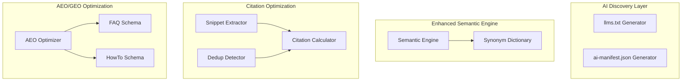

# Design Document: AI Search Optimization

## Overview

This design extends Chimera's capabilities from "AI-findable" to "AI-citable" - ensuring content is not just discoverable by AI agents but actively cited in their responses. The architecture focuses on real, implementable features that analyze and optimize content for AI search engines.

The architecture adds three pillars:

1. **AI Discovery Layer**: `/llms.txt` and `/ai-manifest.json` for proactive AI agent guidance
2. **Semantic Enhancement**: Synonym-aware matching for intent understanding
3. **Citation Optimization**: Quotable snippet extraction, citation scoring, and content differentiation

## Architecture



## Components and Interfaces

### 1. llms.txt Generator

```typescript
interface LLMsConfig {
  siteName: string;
  siteDescription: string;
  baseUrl: string;
  includeApiEndpoints: boolean;
  maxQuickFacts: number;
}

interface RouteEntry {
  path: string;
  description: string;
}

interface ApiEntry {
  method: string;
  path: string;
  description: string;
}

interface LLMsContent {
  header: string;
  quickFacts: string[];
  routes: RouteEntry[];
  apiEndpoints: ApiEntry[];
  lastGenerated: Date;
}

interface LLMsGenerator {
  generate(config: LLMsConfig, pages: PageContent[]): string;
  extractQuickFacts(pages: PageContent[]): string[];
  formatRoutes(routes: RouteEntry[]): string;
}
```

**Output Format**:
```
# llms.txt - AI Agent Manifest for [Site Name]
> [Site Description]

## Quick Facts
- [Statistic or unique claim 1]
- [Statistic or unique claim 2]

## Key Pages
/path - Description of what this page offers
/another - Another page description

## API Endpoints
GET /api/endpoint - What it returns

## Last Updated: [ISO Date]
```

### 2. Semantic Synonym Dictionary

```typescript
interface SynonymGroup {
  canonical: string;
  synonyms: string[];
  weight: number;  // Default 0.8
}

interface SynonymDictionary {
  groups: SynonymGroup[];
  expand(token: string): string[];
  addSynonym(word: string, synonyms: string[]): void;
  getSimilarityWeight(token1: string, token2: string): number;
  findGroup(token: string): SynonymGroup | null;
}

// Built-in synonym groups for common e-commerce/web terms
const BUILTIN_SYNONYMS: SynonymGroup[] = [
  { canonical: 'phone', synonyms: ['smartphone', 'mobile', 'cell', 'handset'], weight: 0.8 },
  { canonical: 'buy', synonyms: ['purchase', 'shop', 'order', 'get', 'acquire'], weight: 0.8 },
  { canonical: 'docs', synonyms: ['documentation', 'guide', 'manual', 'reference', 'help'], weight: 0.8 },
  { canonical: 'auth', synonyms: ['authentication', 'login', 'signin', 'sign-in', 'access'], weight: 0.8 },
  { canonical: 'api', synonyms: ['endpoint', 'service', 'interface', 'rest'], weight: 0.8 },
  { canonical: 'price', synonyms: ['cost', 'pricing', 'rate', 'fee', 'charge'], weight: 0.8 },
  { canonical: 'contact', synonyms: ['support', 'help', 'reach', 'email', 'call'], weight: 0.8 },
  { canonical: 'about', synonyms: ['company', 'team', 'who', 'story', 'mission'], weight: 0.8 },
];
```

### 3. Quotable Snippet Extractor

```typescript
interface QuotableSnippet {
  text: string;
  source: string;
  citationScore: number;  // 0-100
  hasStatistic: boolean;
  hasUniqueData: boolean;
  characterCount: number;
  suggestedImprovements: string[];
}

interface SnippetExtractor {
  extract(content: string, source?: string): QuotableSnippet[];
  scoreSnippet(text: string): number;
  identifyCitationAnchors(content: string): string[];
  hasStatistic(text: string): boolean;
  hasAttribution(text: string): boolean;
}

// Scoring weights
const SNIPPET_WEIGHTS = {
  hasStatistic: 30,      // Contains numbers/percentages
  isUnique: 25,          // Not commodity content
  isSpecific: 20,        // Names specific things
  isConcise: 15,         // Under 280 chars
  hasAttribution: 10     // Cites a source
};

// Regex patterns for statistic detection
const STATISTIC_PATTERNS = [
  /\d+%/,                           // Percentages
  /\d+x/i,                          // Multipliers (2x, 10x)
  /\$[\d,]+/,                       // Dollar amounts
  /\d+\s*(million|billion|thousand)/i,  // Large numbers
  /\d+\s*(users|customers|clients)/i,   // User counts
  /\d+\s*(days|hours|minutes|seconds)/i, // Time metrics
  /increased?\s+by\s+\d+/i,         // Increase statements
  /decreased?\s+by\s+\d+/i,         // Decrease statements
  /\d+\s*-\s*\d+/,                  // Ranges
];
```

### 4. AEO Optimizer

```typescript
interface AEOResult {
  faqSchema: FAQSchema | null;
  howToSchema: HowToSchema | null;
  featuredSnippetCandidate: string | null;
  voiceReadyScore: number;  // 0-100
  suggestions: string[];
}

interface FAQSchema {
  '@context': 'https://schema.org';
  '@type': 'FAQPage';
  mainEntity: FAQItem[];
}

interface FAQItem {
  '@type': 'Question';
  name: string;
  acceptedAnswer: {
    '@type': 'Answer';
    text: string;
  };
}

interface HowToSchema {
  '@context': 'https://schema.org';
  '@type': 'HowTo';
  name: string;
  step: HowToStep[];
}

interface HowToStep {
  '@type': 'HowToStep';
  position: number;
  name: string;
  text: string;
}

interface AEOOptimizer {
  analyze(content: string): AEOResult;
  extractFAQ(content: string): FAQSchema | null;
  extractHowTo(content: string): HowToSchema | null;
  findFeaturedSnippetCandidate(content: string): string | null;
  countWords(text: string): number;
}

// Q&A detection patterns
const QA_PATTERNS = [
  /^(what|how|why|when|where|who|which|can|does|is|are|will|should)\s+.+\?/im,
  /^\*\*Q:\*\*\s*.+/m,
  /^Q:\s*.+/m,
  /^Question:\s*.+/im,
];

// Step detection patterns
const STEP_PATTERNS = [
  /^(\d+)\.\s+(.+)/m,           // 1. Step text
  /^Step\s+(\d+):\s*(.+)/im,    // Step 1: text
  /^-\s+(.+)/m,                 // - Bullet point
];
```

### 5. Citation Score Calculator

```typescript
interface CitationScore {
  total: number;  // 0-100
  breakdown: {
    uniqueData: number;        // 0-40
    sourceAttribution: number; // 0-20
    quotableSnippets: number;  // 0-20
    schemaCoverage: number;    // 0-20
  };
  recommendations: string[];
}

interface RankedPage {
  url: string;
  citationScore: number;
  topSnippet: string;
}

interface CitationCalculator {
  calculate(page: PageContent): CitationScore;
  rankPages(pages: PageContent[]): RankedPage[];
  getRecommendations(score: CitationScore): string[];
}

// Recommendation templates
const RECOMMENDATIONS = {
  lowUniqueData: 'Add specific statistics, case studies, or original research to increase unique data score',
  lowAttribution: 'Include source citations and methodology descriptions for claims',
  lowSnippets: 'Create more concise, quotable statements under 280 characters',
  lowSchema: 'Add FAQ or HowTo structured data to improve schema coverage',
};
```

### 6. Deduplication Detector

```typescript
interface DedupResult {
  commodityPhrasePercentage: number;
  isLowDifferentiation: boolean;  // true if > 30%
  commodityPhrases: string[];
  citationAnchors: string[];
  suggestions: string[];
}

interface DedupDetector {
  analyze(content: string): DedupResult;
  identifyCommodityPhrases(content: string): string[];
  findCitationAnchors(content: string): string[];
  calculateCommodityPercentage(content: string, phrases: string[]): number;
}

// Common commodity phrases that provide no differentiation
const COMMODITY_PHRASES = [
  'industry-leading',
  'best-in-class',
  'cutting-edge',
  'state-of-the-art',
  'world-class',
  'innovative solutions',
  'customer-centric',
  'seamless experience',
  'next-generation',
  'game-changing',
  'revolutionary',
  'unparalleled',
  'comprehensive solution',
  'end-to-end',
  'holistic approach',
  'synergy',
  'leverage',
  'paradigm shift',
  'best practices',
  'value-added',
  'mission-critical',
  'scalable solution',
  'robust platform',
  'turnkey solution',
];
```

### 7. AI Manifest Generator

```typescript
interface AIManifest {
  name: string;
  description: string;
  version: string;
  capabilities: string[];
  routes: ManifestRoute[];
  intents: Intent[];
  entities: Entity[];
  lastUpdated: string;
}

interface ManifestRoute {
  path: string;
  description: string;
  methods?: string[];
}

interface Intent {
  name: string;
  description: string;
  examples: string[];
}

interface Entity {
  name: string;
  type: string;
  description: string;
}

interface ManifestConfig {
  siteName: string;
  siteDescription: string;
  version: string;
  capabilities: string[];
}

interface ManifestGenerator {
  generate(config: ManifestConfig, pages: PageContent[]): AIManifest;
  extractIntents(pages: PageContent[]): Intent[];
  extractEntities(pages: PageContent[]): Entity[];
}
```

## Data Models

### Page Content Model

```typescript
interface PageContent {
  url: string;
  title: string;
  description: string;
  content: string;
  headings: string[];
  statistics: Statistic[];
  lastModified: Date;
}

interface Statistic {
  value: string;
  context: string;
  source?: string;
}
```

### Analysis Result Model

```typescript
interface AISearchAnalysis {
  url: string;
  citationScore: CitationScore;
  aeoResult: AEOResult;
  geoScore: number;
  quotableSnippets: QuotableSnippet[];
  dedupResult: DedupResult;
  recommendations: string[];
}
```

## Correctness Properties

*A property is a characteristic or behavior that should hold true across all valid executions of a system-essentially, a formal statement about what the system should do. Properties serve as the bridge between human-readable specifications and machine-verifiable correctness guarantees.*

### Property 1: llms.txt Content Completeness

*For any* valid LLMsConfig with site name, description, and routes, the generated llms.txt output SHALL contain the site name, site description, all provided routes with descriptions, and all provided API endpoints.

**Validates: Requirements 1.2, 1.3, 1.4**

### Property 2: Quick Facts Extraction

*For any* content containing sentences with statistics (numbers, percentages, comparisons), the LLMs_Generator SHALL extract those sentences as quick facts in the output.

**Validates: Requirements 1.5**

### Property 3: Synonym Expansion Completeness

*For any* token that exists in the synonym dictionary, calling expand() SHALL return all synonyms in that token's group including the canonical term.

**Validates: Requirements 2.1**

### Property 4: Synonym Match Weighting

*For any* two tokens where one is a synonym of the other, the similarity weight SHALL be exactly 0.8x the weight of an exact match.

**Validates: Requirements 2.5**

### Property 5: Statistic Sentence Identification

*For any* content string, all sentences containing numeric statistics (percentages, numbers with units, comparisons) SHALL be identified by the Snippet_Extractor.

**Validates: Requirements 3.1**

### Property 6: Citation Anchor Flagging

*For any* sentence containing a unique claim with supporting data, the Snippet_Extractor SHALL flag it as a citation anchor.

**Validates: Requirements 3.2**

### Property 7: Snippet Length Preference

*For any* set of extracted snippets, snippets under 280 characters SHALL rank higher than equivalent snippets over 280 characters when other scoring factors are equal.

**Validates: Requirements 3.3, 3.4**

### Property 8: Top Snippets Limit

*For any* content analysis, the Snippet_Extractor SHALL return at most 5 quotable snippets, ordered by citation score descending.

**Validates: Requirements 3.5**

### Property 9: Attribution Suggestion

*For any* quotable snippet that lacks source attribution, the Snippet_Extractor SHALL include a suggestion to add a source or methodology.

**Validates: Requirements 3.6**

### Property 10: FAQ Schema Extraction

*For any* content containing Q&A patterns (question followed by answer), the AEO_Optimizer SHALL generate valid FAQPage schema with those Q&A pairs.

**Validates: Requirements 4.1**

### Property 11: HowTo Schema Extraction

*For any* content containing numbered or bulleted step-by-step instructions, the AEO_Optimizer SHALL generate valid HowTo schema with those steps.

**Validates: Requirements 4.2**

### Property 12: Featured Snippet Length Warning

*For any* featured snippet candidate exceeding 50 words, the AEO_Optimizer SHALL include a suggestion to condense the content.

**Validates: Requirements 4.4**

### Property 13: AI Manifest Content Completeness

*For any* valid ManifestConfig, the generated ai-manifest.json SHALL contain name, description, capabilities, routes, intents, and entities fields.

**Validates: Requirements 5.2, 5.3, 5.4**

### Property 14: Citation Score Range

*For any* page content, the Citation_Calculator SHALL compute a total score between 0 and 100 inclusive.

**Validates: Requirements 6.1**

### Property 15: Citation Score Weighting

*For any* page content, the Citation_Calculator SHALL compute the score using exactly: unique data (40%), source attribution (20%), quotable snippets (20%), schema coverage (20%).

**Validates: Requirements 6.2**

### Property 16: Low Score Recommendations

*For any* page with a citation score below 50, the Citation_Calculator SHALL provide at least one specific recommendation for improvement.

**Validates: Requirements 6.3**

### Property 17: Page Ranking Consistency

*For any* set of pages, the Citation_Calculator SHALL rank them in descending order by citation score.

**Validates: Requirements 6.5**

### Property 18: Commodity Phrase Detection

*For any* content containing known commodity phrases, the Dedup_Detector SHALL identify and list those phrases.

**Validates: Requirements 7.1**

### Property 19: Low Differentiation Threshold

*For any* content where commodity phrases exceed 30% of total content, the Dedup_Detector SHALL flag it as low differentiation.

**Validates: Requirements 7.2**

### Property 20: Unique Content Highlighting

*For any* content containing unique statistics or claims not found in the commodity phrase list, the Dedup_Detector SHALL highlight them as citation anchors.

**Validates: Requirements 7.4**

## Error Handling

### Generator Errors

| Error | Cause | Handling |
|-------|-------|----------|
| `EmptyConfigError` | Missing required config fields | Return validation error with missing fields |
| `NoRoutesError` | No routes provided for llms.txt | Generate minimal file with warning |
| `InvalidContentError` | Malformed page content | Skip page, log warning, continue |

### Analysis Errors

| Error | Cause | Handling |
|-------|-------|----------|
| `ContentTooShortError` | Content under 100 characters | Return score of 0 with "insufficient content" message |
| `NoStatisticsFoundError` | No extractable statistics | Return empty snippets array, suggest adding data |
| `SchemaGenerationError` | Invalid content structure | Return null schema, log reason |

## Testing Strategy

### Property-Based Testing Library

This project will use **fast-check** for property-based testing in TypeScript/JavaScript.

### Unit Tests

Unit tests will cover:
- Specific examples of llms.txt generation with known inputs
- Edge cases for synonym matching (empty strings, special characters)
- HTTP endpoint responses for /llms.txt and /ai-manifest.json
- Schema validation for generated FAQ and HowTo schemas

### Property-Based Tests

Each correctness property will be implemented as a property-based test using fast-check:

- Tests will run a minimum of 100 iterations
- Each test will be tagged with: `**Feature: ai-search-optimization, Property {number}: {property_text}**`
- Generators will create random but valid inputs (site configs, content strings, page arrays)

### Test Organization

```
tests/
├── unit/
│   ├── llms-generator.test.ts
│   ├── synonym-dictionary.test.ts
│   ├── snippet-extractor.test.ts
│   ├── aeo-optimizer.test.ts
│   ├── citation-calculator.test.ts
│   └── dedup-detector.test.ts
├── property/
│   ├── llms-generator.property.test.ts
│   ├── semantic-engine.property.test.ts
│   ├── snippet-extractor.property.test.ts
│   ├── aeo-optimizer.property.test.ts
│   ├── citation-calculator.property.test.ts
│   └── dedup-detector.property.test.ts
└── integration/
    ├── ai-discovery-endpoints.test.ts
    └── full-analysis-pipeline.test.ts
```
