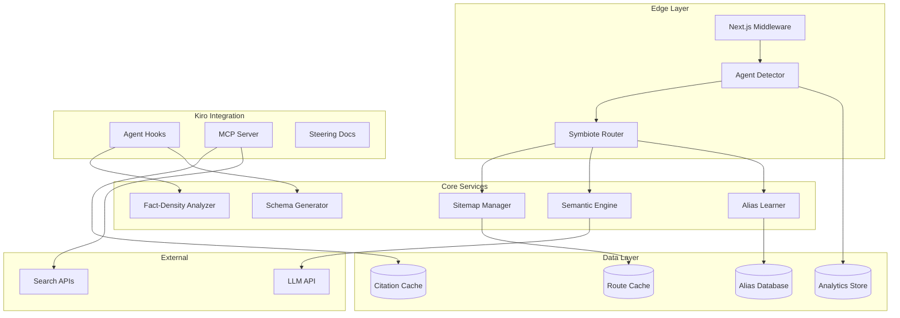
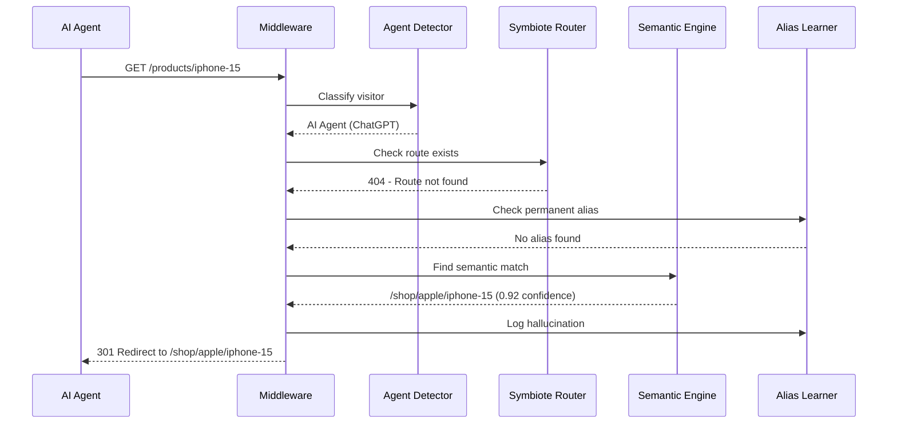

# Design Document: Chimera - AI-First Edge

## Overview

Chimera is a Next.js middleware and development toolkit that optimizes web applications for the "Agent Economy"—where AI agents (ChatGPT, Perplexity, Gemini) browse, index, and transact on behalf of users. The system addresses the critical "AI Bounce" problem: AI agents have zero tolerance for errors and immediately abandon sites that return 404s or present unstructured content.

The architecture consists of three core pillars:
1. **Symbiote Router**: Intercepts 404 errors and performs semantic fuzzy matching to redirect hallucinated URLs to valid routes
2. **Fact-Density Analyzer**: Kiro hooks that analyze content scannability and auto-generate JSON-LD schemas
3. **Citation Network Monitor**: MCP-powered tool tracking brand mentions and earned media authority

## Architecture



### Request Flow



## Components and Interfaces

### 1. Symbiote Router

The core middleware that intercepts 404 responses and performs fuzzy routing.

```typescript
interface SymbioteRouterConfig {
  confidenceThreshold: number;      // Minimum similarity score (default: 0.7)
  maxLatencyMs: number;             // Maximum added latency (default: 100)
  enableLearning: boolean;          // Auto-create aliases
  aliasThreshold: number;           // Redirects before creating alias (default: 3)
}

interface RouteMatch {
  originalPath: string;
  matchedPath: string;
  confidence: number;
  method: 'alias' | 'semantic' | 'none';
  latencyMs: number;
}

interface SymbioteRouter {
  // Core routing
  intercept(request: NextRequest): Promise<NextResponse>;
  findSemanticMatch(path: string): Promise<RouteMatch>;
  
  // Alias management
  getAliases(): Promise<Alias[]>;
  createAlias(from: string, to: string): Promise<void>;
  deleteAlias(from: string): Promise<void>;
  
  // Analytics
  getHallucinationLog(): Promise<HallucinationEntry[]>;
}
```

### 2. Semantic Engine

Performs semantic similarity matching between hallucinated paths and valid routes.

```typescript
interface SemanticEngine {
  // Tokenization
  tokenizePath(path: string): string[];
  
  // Matching
  findBestMatch(
    hallucinatedPath: string, 
    validRoutes: string[]
  ): Promise<SemanticMatch>;
  
  // Embedding (for advanced matching)
  getEmbedding(text: string): Promise<number[]>;
  cosineSimilarity(a: number[], b: number[]): number;
}

interface SemanticMatch {
  route: string;
  confidence: number;
  matchedTokens: string[];
  reasoning: string;
}
```

### 3. Fact-Density Analyzer

Analyzes content for AI scannability and suggests improvements.

```typescript
interface FactDensityResult {
  score: number;                    // 0-1 scannability score
  breakdown: {
    tables: number;                 // Count of data tables
    bulletLists: number;            // Count of bullet lists
    statistics: number;             // Count of quantitative data points
    headers: number;                // Count of structured headers
    headerHierarchyValid: boolean;  // Headers follow logical order
  };
  suggestions: Suggestion[];
  justificationLevel: 'high' | 'medium' | 'low';
}

interface Suggestion {
  type: 'add-table' | 'add-stats' | 'fix-headers' | 'reduce-fluff';
  location: { line: number; column: number };
  message: string;
  autoFixAvailable: boolean;
}

interface FactDensityAnalyzer {
  analyze(content: string, fileType: 'tsx' | 'md'): FactDensityResult;
  suggestTable(prose: string): string;
  extractStatistics(content: string): Statistic[];
}
```

### 4. Schema Generator

Auto-generates JSON-LD structured data from page content.

```typescript
interface SchemaGeneratorConfig {
  defaultOrganization: Organization;
  enableAutoDetection: boolean;
}

interface GeneratedSchema {
  '@context': 'https://schema.org';
  '@graph': SchemaEntity[];
}

interface SchemaEntity {
  '@type': string;
  '@id'?: string;
  [key: string]: unknown;
}

interface SchemaGenerator {
  // Detection
  detectEntities(content: string): DetectedEntity[];
  
  // Generation
  generateSchema(entities: DetectedEntity[]): GeneratedSchema;
  
  // Validation
  validateSchema(schema: GeneratedSchema): ValidationResult;
  
  // Serialization (for round-trip testing)
  serialize(schema: GeneratedSchema): string;
  parse(jsonLd: string): GeneratedSchema;
}
```

### 5. Citation Monitor (MCP Server)

Tracks brand mentions and earned media across the web.

```typescript
interface CitationMonitorConfig {
  brandTerms: string[];
  searchApiKey: string;
  scanIntervalHours: number;
}

interface Citation {
  id: string;
  sourceUrl: string;
  sourceDomain: string;
  mentionContext: string;
  sentiment: 'positive' | 'neutral' | 'negative';
  domainAuthority: number;
  discoveredAt: Date;
}

interface GEOHealthScore {
  overall: number;                  // 0-100
  components: {
    routeHealth: number;
    contentScannability: number;
    schemaCoverage: number;
    citationAuthority: number;
  };
  recommendations: string[];
}

interface CitationMonitor {
  // Scanning
  scanForCitations(): Promise<Citation[]>;
  
  // Analysis
  calculateGEOScore(): Promise<GEOHealthScore>;
  
  // Notifications
  getNewCitations(since: Date): Promise<Citation[]>;
}
```

### 6. Agent Detector

Identifies AI agents from request signatures.

```typescript
type AgentType = 
  | 'ChatGPT' 
  | 'Perplexity' 
  | 'Claude' 
  | 'Gemini' 
  | 'Generic-Bot' 
  | 'Human';

interface AgentDetectionResult {
  type: AgentType;
  confidence: number;
  signals: string[];              // What triggered detection
}

interface AgentDetector {
  detect(request: NextRequest): AgentDetectionResult;
  getKnownSignatures(): AgentSignature[];
  addSignature(signature: AgentSignature): void;
}
```

## Data Models

### Route Alias

```typescript
interface Alias {
  id: string;
  fromPath: string;               // Hallucinated path
  toPath: string;                 // Valid destination
  hitCount: number;               // Times used
  createdAt: Date;
  lastUsedAt: Date;
  autoGenerated: boolean;         // Created by learning system
}
```

### Hallucination Log Entry

```typescript
interface HallucinationEntry {
  id: string;
  timestamp: Date;
  hallucinatedPath: string;
  matchedPath: string | null;
  confidence: number;
  agentType: AgentType;
  outcome: 'redirected' | '404' | 'alias-used';
  latencyMs: number;
}
```

### Analytics Record

```typescript
interface AnalyticsRecord {
  id: string;
  timestamp: Date;
  path: string;
  agentType: AgentType;
  wasRedirected: boolean;
  sessionId: string;
  conversionEvent: string | null;
}
```

### Content Analysis Cache

```typescript
interface ContentAnalysis {
  filePath: string;
  lastAnalyzed: Date;
  factDensityScore: number;
  schemaGenerated: boolean;
  suggestions: Suggestion[];
}
```


## Correctness Properties

*A property is a characteristic or behavior that should hold true across all valid executions of a system-essentially, a formal statement about what the system should do. Properties serve as the bridge between human-readable specifications and machine-verifiable correctness guarantees.*

Based on the acceptance criteria analysis, the following correctness properties must be verified through property-based testing:

### Property 1: 404 Interception Completeness
*For any* HTTP request to a non-existent route, the Symbiote Router middleware SHALL intercept the response before it reaches the client, ensuring no raw 404 escapes without processing.
**Validates: Requirements 1.1**

### Property 2: Semantic Match Confidence Threshold
*For any* hallucinated path and set of valid routes, if the semantic matching returns a confidence score above 0.7, the system SHALL return a 301 redirect; if below 0.7, the system SHALL return a 404 with machine-readable payload.
**Validates: Requirements 1.3, 1.4**

### Property 3: URL Tokenization Consistency
*For any* URL path containing slashes, hyphens, or underscores, the tokenizer SHALL extract the same semantic tokens regardless of separator type, and tokenizing then joining SHALL preserve semantic meaning.
**Validates: Requirements 1.6**

### Property 4: Hallucination Logging Completeness
*For any* successful fuzzy redirect, the log entry SHALL contain all required fields: hallucinated path, matched path, confidence score, timestamp, and agent type.
**Validates: Requirements 1.5**

### Property 5: Alias Learning Threshold
*For any* hallucinated path that is successfully redirected N times (where N >= aliasThreshold), the system SHALL create a permanent alias; for N < aliasThreshold, no alias SHALL be created.
**Validates: Requirements 2.1**

### Property 6: Alias Priority Over Semantic Matching
*For any* request to a path with an existing alias, the system SHALL return the aliased route without invoking the semantic matching engine, and the response latency SHALL be lower than semantic matching latency.
**Validates: Requirements 2.2**

### Property 7: Alias Deletion Restores Semantic Matching
*For any* alias that is deleted, subsequent requests to that path SHALL invoke semantic matching rather than returning the previously aliased route.
**Validates: Requirements 2.4**

### Property 8: Fact-Density Score Calculation
*For any* content with N tables, M bullet lists, P statistics, and Q structured headers, the scannability score SHALL be a deterministic function of these counts, and content with more structured elements SHALL score higher than content with fewer.
**Validates: Requirements 3.1**

### Property 9: Low Scannability Triggers Suggestions
*For any* content with a scannability score below 0.5, the analyzer SHALL return at least one actionable suggestion; for scores above 0.5, suggestions are optional.
**Validates: Requirements 3.2**

### Property 10: Header Hierarchy Validation
*For any* content with headers, if a header level is skipped (e.g., H1 followed by H3), the analyzer SHALL flag the hierarchy as invalid; if headers follow sequential levels, the hierarchy SHALL be marked valid.
**Validates: Requirements 3.5**

### Property 11: JSON-LD Round-Trip Consistency
*For any* valid GeneratedSchema object, serializing to JSON-LD string and parsing back SHALL produce an equivalent object. This is the critical serialization correctness property.
**Validates: Requirements 4.6**

### Property 12: Schema Entity Detection
*For any* content containing identifiable entities (Product, Article, Organization, Person, FAQ), the Schema Generator SHALL detect and correctly classify each entity type present.
**Validates: Requirements 4.1**

### Property 13: Schema Required Properties
*For any* detected entity type, the generated JSON-LD SHALL include all required properties as defined by Schema.org for that type.
**Validates: Requirements 4.3**

### Property 14: Citation Ranking Order
*For any* set of citations, when sorted for display, citations with higher domain authority SHALL appear before those with lower authority; for equal authority, more recent citations SHALL appear first.
**Validates: Requirements 5.3**

### Property 15: GEO Score Earned Media Weighting
*For any* GEO Health Score calculation, earned media citations SHALL contribute more to the score than an equivalent number of brand-owned content pieces.
**Validates: Requirements 5.4**

### Property 16: Dashboard Metric Completeness
*For any* GEO Health Score display, the breakdown SHALL include all four component metrics: Route Health, Content Scannability, Schema Coverage, and Citation Authority.
**Validates: Requirements 6.2**

### Property 17: Content Scannability Average
*For any* set of content pages with known fact-density scores, the displayed average SHALL equal the arithmetic mean of individual scores.
**Validates: Requirements 6.4**

### Property 18: Schema Coverage Percentage
*For any* set of pages where K pages have valid JSON-LD and N total pages exist, the schema coverage percentage SHALL equal (K/N) * 100.
**Validates: Requirements 6.5**

### Property 19: Sitemap Route Completeness
*For any* application with N valid routes, the generated sitemap SHALL contain exactly N route entries, with no duplicates and no missing routes.
**Validates: Requirements 7.1, 7.2**

### Property 20: Sitemap Splitting Threshold
*For any* sitemap with more than 1000 routes, the generator SHALL produce multiple sitemap files plus a sitemap index; for 1000 or fewer routes, a single sitemap file SHALL be produced.
**Validates: Requirements 7.4**

### Property 21: Agent Detection and Classification
*For any* HTTP request with a User-Agent header matching a known AI agent signature, the detector SHALL correctly classify and tag the request with the appropriate agent type.
**Validates: Requirements 8.1, 8.2**

### Property 22: Agent Analytics Logging
*For any* detected AI agent visit, the analytics log SHALL contain agent type, requested path, and outcome (redirected/404/success).
**Validates: Requirements 8.3**

### Property 23: Topic Cluster Relationship Symmetry
*For any* two pages A and B, if A is semantically related to B, then B SHALL be semantically related to A (relationship symmetry).
**Validates: Requirements 9.1**

### Property 24: Orphan Page Detection
*For any* page with zero semantic connections to other pages, the Topic Mapper SHALL flag it as an orphan requiring cluster integration.
**Validates: Requirements 9.4**

## Error Handling

### Middleware Errors

| Error Scenario | Handling Strategy | User Impact |
|---------------|-------------------|-------------|
| Semantic engine timeout | Fall through to 404 | Graceful degradation |
| LLM API failure | Use cached embeddings or fall through | Reduced accuracy |
| Database connection lost | In-memory fallback for aliases | Temporary, no learning |
| Invalid sitemap | Log error, use stale sitemap | Reduced route coverage |

### Content Analysis Errors

| Error Scenario | Handling Strategy | User Impact |
|---------------|-------------------|-------------|
| Malformed content file | Skip analysis, log warning | No suggestions for file |
| Schema validation failure | Return partial schema with errors | Degraded but functional |
| Entity detection ambiguity | Return all possible types | User selects correct type |

### External Service Errors

| Error Scenario | Handling Strategy | User Impact |
|---------------|-------------------|-------------|
| Search API rate limit | Queue requests, retry with backoff | Delayed citation updates |
| Search API authentication failure | Alert admin, disable feature | No citation monitoring |
| Network timeout | Retry 3 times, then fail gracefully | Stale data displayed |

## Testing Strategy

### Dual Testing Approach

This project employs both unit testing and property-based testing to ensure comprehensive coverage:

**Unit Tests** verify specific examples and edge cases:
- Known AI agent User-Agent strings are correctly identified
- Specific URL patterns tokenize correctly
- Schema.org required properties for each entity type

**Property-Based Tests** verify universal properties across all inputs:
- Any valid schema round-trips through serialization
- Any hallucinated URL either redirects or returns proper 404
- Any content analysis produces deterministic scores

### Testing Framework

- **Unit Testing**: Vitest
- **Property-Based Testing**: fast-check
- **Minimum Iterations**: 100 per property test

### Property Test Annotations

Each property-based test MUST be annotated with:
```typescript
/**
 * **Feature: chimera-ai-first-edge, Property 11: JSON-LD Round-Trip Consistency**
 * **Validates: Requirements 4.6**
 */
```

### Test Organization

```
tests/
├── unit/
│   ├── symbiote-router.test.ts
│   ├── semantic-engine.test.ts
│   ├── fact-density.test.ts
│   ├── schema-generator.test.ts
│   ├── agent-detector.test.ts
│   └── citation-monitor.test.ts
├── property/
│   ├── routing.property.test.ts      # Properties 1-7
│   ├── content-analysis.property.test.ts  # Properties 8-10
│   ├── schema.property.test.ts       # Properties 11-13
│   ├── citations.property.test.ts    # Properties 14-15
│   ├── dashboard.property.test.ts    # Properties 16-18
│   ├── sitemap.property.test.ts      # Properties 19-20
│   ├── detection.property.test.ts    # Properties 21-22
│   └── topology.property.test.ts     # Properties 23-24
└── integration/
    ├── middleware.integration.test.ts
    └── hooks.integration.test.ts
```

### Generator Strategies

For property-based testing, we need smart generators:

```typescript
// URL path generator - creates realistic hallucinated paths
const hallucinatedPathGen = fc.array(
  fc.oneof(
    fc.constantFrom('products', 'shop', 'items', 'catalog', 'buy'),
    fc.stringOf(fc.constantFrom('a','b','c','d','e','f','g','h','i'), {minLength: 3, maxLength: 10})
  ),
  {minLength: 1, maxLength: 5}
).map(parts => '/' + parts.join('/'));

// Content generator - creates content with varying structure
const contentGen = fc.record({
  tables: fc.nat({max: 5}),
  bulletLists: fc.nat({max: 10}),
  statistics: fc.nat({max: 20}),
  headers: fc.array(fc.constantFrom(1, 2, 3, 4, 5, 6), {minLength: 0, maxLength: 10})
});

// Schema entity generator
const entityGen = fc.record({
  type: fc.constantFrom('Product', 'Article', 'Organization', 'Person', 'FAQ'),
  name: fc.string({minLength: 1, maxLength: 100}),
  description: fc.string({minLength: 0, maxLength: 500})
});
```
