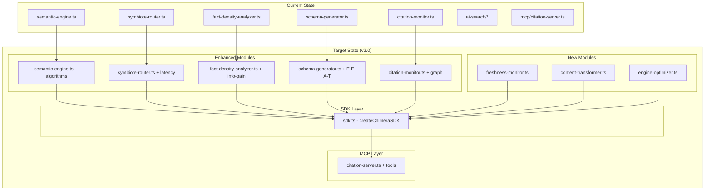

# Design Document: Chimera GEO SDK v2.0

## Overview

This is a **refactoring plan** for the existing Chimera codebase to transform it from a rule-based implementation into a production-grade, scalable SDK using **systems thinking** principles.

### Core Philosophy: Systems Thinking over Rules

**Problem with Current Codebase:**
- Hardcoded rules (regex patterns, static if-else chains, fixed thresholds)
- Assumes uniform site structures
- Brittle handling of query variations, multilingual content, dynamic AI behaviors
- Not scalable for diverse sites

**Solution: Adaptive Systems (No ML, Pure Algorithms)**
- Multi-algorithm fuzzy matching (Levenshtein, Jaro-Winkler, N-Gram, Soundex, Cosine)
- Configurable thresholds and weights (not hardcoded)
- In-memory graph structures for entity resolution (no external DB)
- Multi-signal AI agent detection with confidence scores
- Dynamic rendering recommendations (AI agent → SSR/SSG)
- Extensible interfaces (ML-ready for future SaaS, but no ML in SDK)

### Future Vision: SaaS Foundation

This SDK serves as the **foundational library** for:
- **GEO**: Generative Engine Optimization
- **AIO**: AI Search Optimization  
- **LLMO**: Large Language Model Optimization

In the future, we plan to layer a **SaaS product** on top of this SDK for:
- Automated monitoring dashboards
- Content generation at scale
- Performance analytics
- Similar to DORA AI's autopilot SEO capabilities

### Hackathon Category: Frankenstein 🧟

Chimera fits the **Frankenstein** category perfectly—stitching together:
- Fuzzy URL routing (Symbiote Router) - catches AI hallucinations
- Content analysis (Fact-Density, Information Gain, Inverted Pyramid)
- Schema generation (JSON-LD, E-E-A-T signals)
- Citation monitoring (Reputation Graph, Earned Media tracking)
- AI agent detection & handling (Zero-tolerance policy)
- Freshness monitoring (Staleness detection, velocity tracking)
- Content transformation (Listicles, Comparisons)
- Engine-specific optimization (Claude, GPT, Perplexity, Gemini)

Into one powerful SDK that makes any website AI-agent-friendly.

### What We Already Have (Existing Codebase)

```
chimera/src/lib/
├── semantic-engine.ts      ✅ Levenshtein + Jaccard (needs Jaro-Winkler, Cosine)
├── symbiote-router.ts      ✅ Fuzzy routing (needs latency guarantees)
├── agent-detector.ts       ✅ User-Agent detection (needs behavior signals)
├── fact-density-analyzer.ts ✅ Content scoring (needs Information Gain)
├── schema-generator.ts     ✅ JSON-LD generation (needs E-E-A-T)
├── citation-monitor.ts     ✅ Basic tracking (needs Reputation Graph)
├── topic-mapper.ts         ✅ Topic clustering
├── tokenizer.ts            ✅ URL tokenization
├── alias-manager.ts        ✅ Alias storage
├── ai-search/
│   ├── aeo-optimizer.ts    ✅ FAQ/HowTo extraction
│   ├── snippet-extractor.ts ✅ Quotable snippets
│   ├── dedup-detector.ts   ✅ Commodity phrase detection
│   ├── llms-generator.ts   ✅ llms.txt generation
│   ├── manifest-generator.ts ✅ AI manifest
│   ├── citation-calculator.ts ✅ Citation scoring
│   └── synonym-dictionary.ts ✅ Synonym expansion
└── mcp/
    └── citation-server.ts  ✅ MCP server for citation monitoring
```

### Refactoring Strategy: Rule-Based → Systems Thinking

| Module | Current (Rule-Based) | Refactored (Systems Thinking) |
|--------|---------------------|------------------------------|
| `semantic-engine.ts` | Levenshtein + Jaccard only | Multi-algorithm engine with weighted scoring, configurable thresholds, ML-ready feedback interface |
| `symbiote-router.ts` | Basic routing, no latency guarantee | <200ms edge-side caching, batch processing, never return blank pages |
| `agent-detector.ts` | Static User-Agent patterns | Behavior signals, rendering recommendations, ML-ready classification |
| `fact-density-analyzer.ts` | Element counting | Information Gain (entity extraction), Inverted Pyramid, Fluff detection |
| `schema-generator.ts` | Basic entity detection | E-E-A-T signals, round-trip validation, HowTo support |
| `citation-monitor.ts` | Basic tracking | Reputation Graph (sameAs links), Earned vs Owned media, PR outreach suggestions |
| **NEW** `freshness-monitor.ts` | N/A | Staleness detection (>90 days), velocity tracking, CMS webhook integration |
| **NEW** `content-transformer.ts` | N/A | Listicle/comparison generation (AI-preferred formats) |
| **NEW** `engine-optimizer.ts` | N/A | Claude/GPT/Perplexity configs, query fan-out simulation |
| **NEW** `sdk.ts` | N/A | Unified entry point with configurable strategies |

### Key Refactoring Principles

**⚠️ NOTE: No ML Models in SDK**
The SDK uses algorithmic approaches only (no ML dependencies). However, interfaces are designed to be **ML-ready** for future SaaS extensions.

1. **Replace Hardcoded Thresholds with Configuration**
   - Before: `if (score > 0.6)` hardcoded
   - After: `if (score > config.threshold)` configurable via SDK options

2. **Replace Static Patterns with Multi-Signal Detection**
   - Before: `if (userAgent.includes('GPTBot'))` single check
   - After: Multiple signals (User-Agent, headers, behavior) with confidence scores

3. **Extensible Interfaces (ML-Ready, No ML Included)**
   - SDK provides clean interfaces that COULD be extended with ML later
   - No actual ML models or dependencies in the SDK
   - Example: `AgentDetector` interface could accept custom classifiers in future

4. **Graph-Based Entity Resolution (In-Memory)**
   - Before: Simple string matching
   - After: In-memory graph structures (no external DB required)
   - Uses TS data structures, not Neo4j or external graph DBs

5. **Batch Processing for Scale**
   - Before: Single-item processing
   - After: Async batch processing with configurable concurrency

### Design Philosophy

**1. Plug-and-Play SDK for Any Next.js App**
Any developer should be able to `npm install @chimera/geo-sdk` and immediately get:
- Fuzzy URL routing that catches AI hallucinations
- Auto-generated JSON-LD schemas
- Content analysis and optimization suggestions
- GEO Health Score dashboard

**2. Systems Thinking over Rules**
Replace hardcoded thresholds with configurable strategies. Add feedback loops where possible.

---

## Kiro Integration Strategy (Hackathon Requirement)

### Understanding the Three Layers

| Layer | What It Is | Who Uses It | Shipped With SDK? |
|-------|-----------|-------------|-------------------|
| **SDK** | Production library (`@chimera/geo-sdk`) | End-user developers | ✅ Yes |
| **Kiro Hooks** | Developer productivity automation | YOU (during development) | ❌ No (stays in .kiro/) |
| **MCP Server** | AI agent interface for GEO analysis | Kiro IDE, AI agents | ✅ Yes (optional) |

### Kiro Hooks (Developer Productivity - NOT Part of SDK)

Hooks automate YOUR development workflow. They're in `.kiro/hooks/` and help you build faster:

**Existing Hooks:**
- `security-scanner.kiro.hook` - Scans for hardcoded secrets
- `test-scaffold-generator.kiro.hook` - Auto-generates property tests

**New Hooks to Add (for YOUR productivity):**

```
.kiro/hooks/
├── schema-auto-generator.kiro.hook    # When you create a page, suggest JSON-LD
├── content-analyzer.kiro.hook         # When you edit content, check scannability
├── freshness-checker.kiro.hook        # When you update content, check staleness
└── geo-score-reporter.kiro.hook       # After lib changes, report GEO score
```

**Why Hooks Matter for Hackathon:**
- Shows deep Kiro integration
- Demonstrates workflow automation
- Proves you understand Kiro's capabilities beyond vibe coding

### MCP Server (AI Agent Interface - Part of SDK)

The MCP server is how AI agents (including Kiro) interact with GEO analysis:

**Current Tools (6):**
- `scan_citations` - Scan for brand mentions
- `get_citation_stats` - Get citation statistics
- `calculate_geo_score` - Calculate GEO Health Score
- `analyze_content_scannability` - Analyze content for AI readability
- `generate_schema` - Generate JSON-LD structured data
- `build_topic_clusters` - Analyze content relationships

**New Tools to Add (6 more):**
- `analyze_freshness` - Check content staleness and velocity
- `detect_listicle_opportunity` - Find content suitable for AI-preferred formats
- `analyze_information_gain` - Score content for unique facts vs commodity phrases
- `check_inverted_pyramid` - Verify answer appears in first 50-100 words
- `get_engine_recommendations` - Get Claude/GPT/Perplexity-specific tips
- `full_page_analysis` - Run all analyzers and return comprehensive report

**Why MCP Matters for Hackathon:**
- Extends Kiro's capabilities with domain-specific GEO tools
- Enables AI-assisted content optimization
- Shows advanced Kiro integration

---

## Architecture

### Refactoring Strategy

We'll enhance the existing codebase in layers:

```
Layer 1: Algorithm Enhancements (semantic-engine.ts)
         └── Add Jaro-Winkler, N-Gram, Soundex, Cosine algorithms
         
Layer 2: Content Analysis Enhancements (fact-density-analyzer.ts, schema-generator.ts)
         └── Add Information Gain, E-E-A-T, round-trip validation
         
Layer 3: New Modules (freshness-monitor.ts, content-transformer.ts, engine-optimizer.ts)
         └── Staleness detection, listicle generation, engine configs
         
Layer 4: Unified SDK Entry Point (sdk.ts)
         └── Single createChimeraSDK() that exposes everything
         
Layer 5: MCP Server Enhancement (citation-server.ts)
         └── Add Reputation Graph, real-time monitoring
```

### Current vs Target Architecture



### SDK Usage (Target API)

```typescript
import { createChimeraSDK } from '@/lib/sdk';

// Create SDK with configuration
const chimera = createChimeraSDK({
  fuzzy: {
    algorithms: ['levenshtein', 'jaroWinkler', 'cosine'],
    weights: { levenshtein: 0.3, jaroWinkler: 0.4, cosine: 0.3 },
    threshold: 0.7
  },
  analysis: {
    informationGain: true,
    invertedPyramid: { targetWords: 75 }
  },
  schema: {
    includeEEAT: true,
    validateOnGenerate: true
  }
});

// Use individual modules
const routeMatch = chimera.router.resolve('/products/iphone-15-pro');
const analysis = chimera.analyzer.analyze(htmlContent);
const schema = chimera.schema.generate(content, { url: pageUrl });
const freshness = chimera.freshness.analyze(path, lastModified);

// Or use the full pipeline
const result = await chimera.analyzePage({
  url: 'https://example.com/products/iphone',
  content: htmlContent,
  lastModified: new Date()
});
// Returns: { factDensity, schema, freshness, aeo, snippets, dedup }
```

### File Structure (After Refactoring)

```
chimera/src/lib/
├── sdk.ts                    # NEW: Unified SDK entry point
├── semantic-engine.ts        # ENHANCED: Add algorithms
├── symbiote-router.ts        # ENHANCED: Add latency guarantees
├── agent-detector.ts         # ENHANCED: Add behavior signals
├── fact-density-analyzer.ts  # ENHANCED: Add Information Gain
├── schema-generator.ts       # ENHANCED: Add E-E-A-T
├── citation-monitor.ts       # ENHANCED: Add Reputation Graph
├── freshness-monitor.ts      # NEW: Staleness detection
├── content-transformer.ts    # NEW: Listicle generation
├── engine-optimizer.ts       # NEW: Engine-specific configs
├── tokenizer.ts              # KEEP: Already good
├── topic-mapper.ts           # KEEP: Already good
├── alias-manager.ts          # KEEP: Already good
├── ai-search/
│   ├── aeo-optimizer.ts      # KEEP: Already good
│   ├── snippet-extractor.ts  # KEEP: Already good
│   ├── dedup-detector.ts     # KEEP: Already good
│   ├── llms-generator.ts     # KEEP: Already good
│   ├── manifest-generator.ts # KEEP: Already good
│   ├── citation-calculator.ts # KEEP: Already good
│   ├── synonym-dictionary.ts # KEEP: Already good
│   └── types.ts              # ENHANCED: Add new types
└── mcp/
    └── citation-server.ts    # ENHANCED: Add more tools
```

---

## Components and Interfaces

### 1. Semantic Engine Enhancement (semantic-engine.ts)

**Current**: Levenshtein + Jaccard similarity
**Enhancement**: Add Jaro-Winkler, N-Gram, Soundex, Cosine algorithms

```typescript
// NEW: Additional algorithm functions to add
export function jaroWinklerDistance(a: string, b: string, prefixScale?: number): number;
export function nGramSimilarity(a: string, b: string, n?: number): number;
export function soundexMatch(a: string, b: string): boolean;
export function cosineSimilarity(a: string, b: string): number;

// ENHANCED: SemanticEngineConfig with algorithm selection
export interface SemanticEngineConfig {
  minConfidence: number;
  useFuzzyTokens: boolean;
  maxEditDistance: number;
  useSynonyms: boolean;
  synonymDictionary?: SynonymDictionary;
  // NEW: Algorithm configuration
  algorithms: {
    levenshtein: { enabled: boolean; weight: number };
    jaroWinkler: { enabled: boolean; weight: number; prefixScale?: number };
    nGram: { enabled: boolean; weight: number; n?: number };
    soundex: { enabled: boolean; weight: number };
    cosine: { enabled: boolean; weight: number };
  };
  // NEW: Whitelist for normalization
  whitelist?: string[];
}

// ENHANCED: Match result with algorithm breakdown
export interface SemanticMatch {
  route: string;
  confidence: number;
  matchedTokens: string[];
  reasoning: string;
  // NEW: Per-algorithm scores
  algorithmScores?: Record<string, number>;
  processingTimeMs?: number;
}
```

### 2. Agent Detector Enhancement (agent-detector.ts)

**Current**: User-Agent pattern matching
**Enhancement**: Add behavior signals and rendering recommendations

```typescript
// ENHANCED: AgentDetectionResult with rendering recommendation
export interface AgentDetectionResult {
  type: AgentType;
  confidence: number;
  signals: string[];
  // NEW: Rendering recommendation
  recommendedRendering: 'ssr' | 'csr' | 'json';
  // NEW: Behavior signals
  behaviorSignals?: {
    acceptsJson: boolean;
    noJsExecution: boolean;
    rapidRequests: boolean;
  };
}

// NEW: Function to get rendering recommendation
export function getRecommendedRendering(result: AgentDetectionResult): 'ssr' | 'csr' | 'json';
```

### 3. Symbiote Router Enhancement (symbiote-router.ts)

**Current**: Basic fuzzy routing
**Enhancement**: Add latency guarantees and metrics

```typescript
// ENHANCED: Config with latency guarantee
export interface SymbioteRouterConfig {
  confidenceThreshold: number;
  maxLatencyMs: number;  // Hard limit: 200ms
  enableLearning: boolean;
  aliasThreshold: number;
  // NEW: Timeout behavior
  timeoutBehavior: 'return-404' | 'return-cached' | 'return-suggestions';
}

// ENHANCED: Result with timing
export interface SymbioteResult {
  shouldRedirect: boolean;
  redirectPath: string | null;
  match: RouteMatch;
  logEntry: HallucinationEntry;
  // NEW: Timing guarantee
  withinLatencyBudget: boolean;
}

// NEW: Metrics tracking
export interface RouterMetrics {
  totalRequests: number;
  exactMatches: number;
  fuzzyMatches: number;
  notFound: number;
  averageLatencyMs: number;
  p99LatencyMs: number;
  aliasHits: number;
}

export function getRouterMetrics(router: SymbioteRouter): RouterMetrics;
```

### 4. Fact-Density Analyzer Enhancement (fact-density-analyzer.ts)

**Current**: Element counting (tables, lists, headers)
**Enhancement**: Add Information Gain and Inverted Pyramid scoring

```typescript
// NEW: Information Gain result
export interface InformationGainResult {
  score: number;  // 0-100
  uniqueEntities: string[];
  commodityPhrasePercentage: number;
  commodityPhrases: string[];
}

// NEW: Inverted Pyramid result
export interface InvertedPyramidResult {
  score: number;  // 0-100
  answerPosition: number;  // Word position of main answer
  isOptimal: boolean;  // Answer in first 50-100 words
}

// ENHANCED: FactDensityResult with new metrics
export interface FactDensityResult {
  score: number;
  breakdown: ContentBreakdown;
  suggestions: Suggestion[];
  justificationLevel: JustificationLevel;
  // NEW: Additional metrics
  informationGain?: InformationGainResult;
  invertedPyramid?: InvertedPyramidResult;
  fluffScore?: number;  // 0-100, higher = more fluffy
}

// NEW: Functions to add
export function calculateInformationGain(content: string): InformationGainResult;
export function scoreInvertedPyramid(content: string): InvertedPyramidResult;
export function detectFluff(content: string): { score: number; phrases: string[] };
```

### 5. Schema Generator Enhancement (schema-generator.ts)

**Current**: Basic entity detection (Product, Article, Organization, Person, FAQ)
**Enhancement**: Add E-E-A-T signals and round-trip validation

```typescript
// NEW: E-E-A-T signals
export interface EEATSignals {
  author?: {
    name: string;
    credentials?: string[];
    linkedInUrl?: string;
    sameAs?: string[];
  };
  datePublished?: string;
  dateModified?: string;
  publisher?: {
    name: string;
    url: string;
    logo?: string;
  };
}

// ENHANCED: GeneratedSchema with E-E-A-T
export interface GeneratedSchema {
  '@context': 'https://schema.org';
  '@graph': SchemaEntity[];
  // NEW: E-E-A-T signals
  eeat?: EEATSignals;
}

// NEW: Functions to add
export function addEEATSignals(schema: GeneratedSchema, signals: EEATSignals): GeneratedSchema;
export function validateRoundTrip(schema: GeneratedSchema): boolean;
```

### 6. NEW: Freshness Monitor (freshness-monitor.ts)

```typescript
export interface FreshnessConfig {
  staleThresholdDays: number;  // Default: 90
  velocityWindowMonths: number;  // Default: 3
}

export interface FreshnessMetrics {
  path: string;
  lastModified: Date;
  ageInDays: number;
  isStale: boolean;
  velocity: number;  // Updates per month
  refreshPriority: 'critical' | 'high' | 'medium' | 'low';
}

export function analyzeFreshness(path: string, lastModified: Date, config?: FreshnessConfig): FreshnessMetrics;
export function getStalePages(pages: Array<{ path: string; lastModified: Date }>): FreshnessMetrics[];
export function calculateVelocity(updateHistory: Date[]): number;
export function createFreshnessMonitor(config?: FreshnessConfig): FreshnessMonitor;
```

### 7. NEW: Content Transformer (content-transformer.ts)

```typescript
export interface TransformationResult {
  original: string;
  transformed: string;
  format: 'roundup' | 'comparison' | 'topN' | 'faq';
  confidence: number;
  itemsExtracted: number;
}

export function detectListicleSuitability(content: string): { suitable: boolean; format: string; confidence: number };
export function transformToRoundup(content: string): TransformationResult;
export function generateComparisonTable(content: string): string;
export function createTopNList(content: string, n: number): string;
export function createContentTransformer(): ContentTransformer;
```

### 8. NEW: Engine Optimizer (engine-optimizer.ts)

```typescript
export type AIEngine = 'claude' | 'gpt' | 'perplexity' | 'gemini';

export interface EngineConfig {
  name: AIEngine;
  biases: {
    earnedMediaWeight: number;
    listiclePreference: number;
    freshnessWeight: number;
  };
  queryFanOut: {
    minSubQueries: number;
    maxSubQueries: number;
  };
}

export function getEngineConfig(engine: AIEngine): EngineConfig;
export function generateSubQueries(query: string, engine: AIEngine): string[];
export function calculateDomainOverlap(results1: string[], results2: string[]): number;
export function createEngineOptimizer(): EngineOptimizer;
```

### 9. Citation Monitor Enhancement (citation-monitor.ts)

**Current**: Basic citation tracking with sentiment analysis
**Enhancement**: Add Reputation Graph with sameAs links

```typescript
// NEW: Reputation Graph types
export interface ReputationNode {
  id: string;
  type: 'brand' | 'source' | 'entity';
  authority: number;
  sameAs: string[];  // Schema.org sameAs links
}

export interface ReputationEdge {
  source: string;
  target: string;
  type: 'citation' | 'sameAs' | 'topic';
  weight: number;
}

// NEW: Reputation Graph functions
export function createReputationGraph(): ReputationGraph;
export function addSameAsLink(graph: ReputationGraph, entityId: string, sameAsUrl: string): void;
export function calculateAuthorityScore(graph: ReputationGraph, nodeId: string): number;
export function suggestOutreach(graph: ReputationGraph): OutreachSuggestion[];

export interface OutreachSuggestion {
  platform: 'reddit' | 'wikipedia' | 'linkedin' | 'github';
  reason: string;
  expectedImpact: number;
  priority: 'high' | 'medium' | 'low';
}
```

### 10. MCP Server Enhancement (mcp/citation-server.ts)

**Current**: 6 tools for citation monitoring and content analysis
**Enhancement**: Add 6 more tools for comprehensive GEO optimization

**Why MCP Matters for Hackathon:**
- Extends Kiro's capabilities with domain-specific GEO tools
- Enables AI-assisted content optimization
- Shows advanced Kiro integration beyond basic vibe coding
- MCP tools can be called by Kiro hooks for automated workflows

```typescript
// EXISTING TOOLS (keep):
// - scan_citations: Scan for brand mentions
// - get_citation_stats: Get citation statistics
// - calculate_geo_score: Calculate GEO Health Score
// - analyze_content_scannability: Analyze content for AI readability
// - generate_schema: Generate JSON-LD structured data
// - build_topic_clusters: Analyze content relationships

// NEW TOOLS to add:

/**
 * Tool: analyze_freshness
 * Checks content staleness and velocity metrics
 */
{
  name: 'analyze_freshness',
  description: 'Check content staleness and update velocity. Returns age in days, staleness flag, and refresh priority.',
  inputSchema: {
    type: 'object',
    properties: {
      path: { type: 'string', description: 'Page path to analyze' },
      lastModified: { type: 'string', description: 'ISO date of last modification' }
    },
    required: ['path', 'lastModified']
  }
}

/**
 * Tool: detect_listicle_opportunity
 * Finds content suitable for AI-preferred formats (roundups, comparisons)
 */
{
  name: 'detect_listicle_opportunity',
  description: 'Detect if content is suitable for transformation into AI-preferred formats like roundups, comparison tables, or Top N lists.',
  inputSchema: {
    type: 'object',
    properties: {
      content: { type: 'string', description: 'Content to analyze' }
    },
    required: ['content']
  }
}

/**
 * Tool: analyze_information_gain
 * Scores content for unique facts vs commodity phrases
 */
{
  name: 'analyze_information_gain',
  description: 'Score content for information density. Returns unique entity count, commodity phrase percentage, and overall information gain score.',
  inputSchema: {
    type: 'object',
    properties: {
      content: { type: 'string', description: 'Content to analyze' }
    },
    required: ['content']
  }
}

/**
 * Tool: check_inverted_pyramid
 * Verifies answer appears in first 50-100 words
 */
{
  name: 'check_inverted_pyramid',
  description: 'Check if content follows inverted pyramid structure with key answer in first 50-100 words.',
  inputSchema: {
    type: 'object',
    properties: {
      content: { type: 'string', description: 'Content to analyze' }
    },
    required: ['content']
  }
}

/**
 * Tool: get_engine_recommendations
 * Get Claude/GPT/Perplexity-specific optimization tips
 */
{
  name: 'get_engine_recommendations',
  description: 'Get AI engine-specific optimization recommendations for Claude, GPT, Perplexity, or Gemini.',
  inputSchema: {
    type: 'object',
    properties: {
      engine: { type: 'string', enum: ['claude', 'gpt', 'perplexity', 'gemini'] },
      content: { type: 'string', description: 'Content to optimize' }
    },
    required: ['engine', 'content']
  }
}

/**
 * Tool: full_page_analysis
 * Run all analyzers and return comprehensive report
 */
{
  name: 'full_page_analysis',
  description: 'Run comprehensive GEO analysis on a page. Returns fact density, information gain, inverted pyramid, schema suggestions, freshness, and overall GEO score.',
  inputSchema: {
    type: 'object',
    properties: {
      url: { type: 'string', description: 'Page URL' },
      content: { type: 'string', description: 'Page content (HTML or markdown)' },
      lastModified: { type: 'string', description: 'ISO date of last modification (optional)' }
    },
    required: ['url', 'content']
  }
}
```

**MCP Server Architecture:**
```
┌─────────────────────────────────────────────────────────────┐
│                    MCP Server (citation-server.ts)          │
├─────────────────────────────────────────────────────────────┤
│  Tools (12 total)                                           │
│  ├── Citation Tools                                         │
│  │   ├── scan_citations                                     │
│  │   ├── get_citation_stats                                 │
│  │   └── build_topic_clusters                               │
│  ├── Analysis Tools                                         │
│  │   ├── analyze_content_scannability                       │
│  │   ├── analyze_information_gain (NEW)                     │
│  │   ├── check_inverted_pyramid (NEW)                       │
│  │   └── analyze_freshness (NEW)                            │
│  ├── Generation Tools                                       │
│  │   ├── generate_schema                                    │
│  │   └── detect_listicle_opportunity (NEW)                  │
│  ├── Scoring Tools                                          │
│  │   ├── calculate_geo_score                                │
│  │   └── get_engine_recommendations (NEW)                   │
│  └── Composite Tools                                        │
│      └── full_page_analysis (NEW)                           │
├─────────────────────────────────────────────────────────────┤
│  Calls SDK modules:                                         │
│  semantic-engine, fact-density-analyzer, schema-generator,  │
│  freshness-monitor, content-transformer, engine-optimizer   │
└─────────────────────────────────────────────────────────────┘
```

### 11. Kiro Hooks for Developer Productivity (NOT Part of SDK)

These hooks automate YOUR development workflow. They stay in `.kiro/hooks/` and are NOT shipped with the SDK.

**Why Create These Hooks?**
1. **Hackathon Requirement**: Shows deep Kiro integration
2. **Developer Productivity**: Automates repetitive GEO tasks
3. **Quality Assurance**: Catches issues before they ship

**Existing Hooks (Already Created):**
- `security-scanner.kiro.hook` - Scans for hardcoded secrets
- `test-scaffold-generator.kiro.hook` - Auto-generates property tests when new lib files created

**New Hooks to Create:**

**Hook 1: schema-auto-generator.kiro.hook**
Triggers when you create a new page, suggests JSON-LD schema using MCP tool.
```json
{
  "enabled": true,
  "name": "Schema Auto-Generator",
  "description": "Suggests JSON-LD schema when new pages are created. Uses MCP generate_schema tool.",
  "version": "1",
  "when": {
    "type": "fileCreated",
    "patterns": ["chimera/src/app/**/page.tsx"]
  },
  "then": {
    "type": "askAgent",
    "prompt": "A new page was created at {{filePath}}. Analyze the page content and use the generate_schema MCP tool to create appropriate JSON-LD schema. Suggest where to add the schema in the page (typically in a <script type='application/ld+json'> tag or via Next.js metadata)."
  }
}
```

**Hook 2: content-analyzer.kiro.hook**
Triggers when you edit content files, checks AI scannability using MCP tool.
```json
{
  "enabled": true,
  "name": "Content Scannability Analyzer",
  "description": "Analyzes content for AI scannability when saved. Uses MCP analyze_content_scannability tool.",
  "version": "1",
  "when": {
    "type": "fileEdited",
    "patterns": ["chimera/src/app/**/page.tsx", "**/*.md", "**/*.mdx"]
  },
  "then": {
    "type": "askAgent",
    "prompt": "Content was edited at {{filePath}}. Use the analyze_content_scannability MCP tool to check AI readability. If score < 0.5, suggest specific improvements:\n- Add tables for comparative data\n- Convert paragraphs to bullet lists\n- Add statistics and specific numbers\n- Fix header hierarchy (H1 → H2 → H3)\n- Add JSON-LD structured data"
  }
}
```

**Hook 3: freshness-checker.kiro.hook**
Triggers when content is updated, checks staleness and suggests dateModified updates.
```json
{
  "enabled": true,
  "name": "Freshness Checker",
  "description": "Checks content freshness when updated. Suggests dateModified schema updates.",
  "version": "1",
  "when": {
    "type": "fileEdited",
    "patterns": ["chimera/src/app/**/page.tsx", "**/*.md"]
  },
  "then": {
    "type": "askAgent",
    "prompt": "Content was updated at {{filePath}}. Check if the page has Schema.org dateModified metadata. If not, suggest adding it. If it exists, remind the developer to update it to today's date. Use the analyze_freshness MCP tool if available."
  }
}
```

**Hook 4: geo-score-reporter.kiro.hook**
Triggers when lib files change, reports GEO Health Score using MCP tool.
```json
{
  "enabled": true,
  "name": "GEO Score Reporter",
  "description": "Reports GEO Health Score after lib changes. Uses MCP calculate_geo_score tool.",
  "version": "1",
  "when": {
    "type": "fileEdited",
    "patterns": ["chimera/src/lib/**/*.ts"]
  },
  "then": {
    "type": "askAgent",
    "prompt": "A core library file was modified at {{filePath}}. Use the calculate_geo_score MCP tool to report the current GEO Health Score. If any component scores dropped, highlight the regression and suggest fixes."
  }
}
```

**How Hooks + MCP Work Together:**
```
Developer edits page.tsx
       ↓
Kiro Hook triggers (fileEdited)
       ↓
Hook prompts Kiro agent
       ↓
Agent calls MCP tool (analyze_content_scannability)
       ↓
MCP server runs SDK analysis
       ↓
Agent reports results to developer
```

### 11. NEW: Unified SDK Entry Point (sdk.ts)

```typescript
export interface ChimeraSDKConfig {
  fuzzy?: {
    algorithms?: ('levenshtein' | 'jaroWinkler' | 'nGram' | 'soundex' | 'cosine')[];
    weights?: Record<string, number>;
    threshold?: number;
  };
  analysis?: {
    informationGain?: boolean;
    invertedPyramid?: { targetWords?: number };
  };
  schema?: {
    includeEEAT?: boolean;
    validateOnGenerate?: boolean;
  };
  freshness?: {
    staleThresholdDays?: number;
  };
}

export interface ChimeraSDK {
  // Existing modules (wrapped)
  readonly router: SymbioteRouter;
  readonly analyzer: {
    factDensity: typeof analyze;
    aeo: typeof aeoAnalyze;
    snippets: typeof extractSnippets;
    dedup: typeof dedupAnalyze;
  };
  readonly schema: {
    generate: typeof generateSchema;
    validate: typeof validateSchema;
    serialize: typeof serialize;
    parse: typeof parse;
  };
  readonly citations: {
    monitor: typeof citationMonitor;
    graph: ReputationGraph;
  };
  
  // New modules
  readonly freshness: FreshnessMonitor;
  readonly transformer: ContentTransformer;
  readonly optimizer: EngineOptimizer;
  
  // Convenience methods
  analyzePage(options: { url: string; content: string; lastModified?: Date }): PageAnalysisResult;
  getGEOScore(): GEOHealthScore;
}

export function createChimeraSDK(config?: ChimeraSDKConfig): ChimeraSDK;
```

---

## Data Models

### New Types to Add (types/index.ts)

```typescript
// Add to existing types file

// Information Gain
export interface InformationGainResult {
  score: number;
  uniqueEntities: string[];
  commodityPhrasePercentage: number;
}

// Inverted Pyramid
export interface InvertedPyramidResult {
  score: number;
  answerPosition: number;
  isOptimal: boolean;
}

// E-E-A-T Signals
export interface EEATSignals {
  author?: { name: string; credentials?: string[]; linkedInUrl?: string; sameAs?: string[] };
  datePublished?: string;
  dateModified?: string;
  publisher?: { name: string; url: string };
}

// Freshness
export interface FreshnessMetrics {
  path: string;
  lastModified: Date;
  ageInDays: number;
  isStale: boolean;
  velocity: number;
  refreshPriority: 'critical' | 'high' | 'medium' | 'low';
}

// Content Transformation
export interface TransformationResult {
  original: string;
  transformed: string;
  format: string;
  confidence: number;
  itemsExtracted: number;
}

// Engine Config
export interface EngineConfig {
  name: string;
  biases: { earnedMediaWeight: number; listiclePreference: number; freshnessWeight: number };
  queryFanOut: { minSubQueries: number; maxSubQueries: number };
}

// Reputation Graph
export interface ReputationNode {
  id: string;
  type: 'brand' | 'source' | 'entity';
  authority: number;
  sameAs: string[];
}

// Full Page Analysis (SDK output)
export interface PageAnalysisResult {
  url: string;
  factDensity: FactDensityResult;
  informationGain: InformationGainResult;
  invertedPyramid: InvertedPyramidResult;
  schema: GeneratedSchema;
  freshness: FreshnessMetrics;
  aeo: AEOResult;
  snippets: QuotableSnippet[];
  dedup: DedupResult;
  processingTimeMs: number;
}
```

---

## Correctness Properties

*A property is a characteristic or behavior that should hold true across all valid executions of a system—essentially, a formal statement about what the system should do. Properties serve as the bridge between human-readable specifications and machine-verifiable correctness guarantees.*

### Fuzzy Engine Properties

#### Property 1: Algorithm Score Range Validity
*For any* two strings and any algorithm (Levenshtein, Jaro-Winkler, N-Gram, Soundex, Cosine), the similarity score SHALL be in the range [0, 1] where 0 indicates no similarity and 1 indicates exact match.
**Validates: Requirements 4.1**

#### Property 2: Algorithm Identity Property
*For any* string S and any algorithm, comparing S to itself SHALL return a score of exactly 1.0.
**Validates: Requirements 4.1**

#### Property 3: Algorithm Symmetry Property
*For any* two strings A and B and any algorithm, compare(A, B) SHALL equal compare(B, A).
**Validates: Requirements 4.1**

#### Property 4: Weighted Combiner Correctness
*For any* set of algorithm weights that sum to 1.0 and any input pair, the combined score SHALL equal the weighted sum of individual algorithm scores.
**Validates: Requirements 4.2**

#### Property 5: Threshold Enforcement
*For any* threshold configuration and any findBestMatch operation, all returned matches SHALL have confidence scores at or above the configured threshold.
**Validates: Requirements 4.3**

#### Property 6: Whitelist Normalization Invariant
*For any* string containing whitelisted terms (e.g., "Corp", "Inc", "LLC"), comparing variants with different whitelist term positions SHALL produce equivalent normalized scores.
**Validates: Requirements 4.4**

#### Property 7: Batch Processing Equivalence
*For any* set of inputs and candidates, batch processing SHALL produce identical results to sequential processing of the same inputs (order preserved).
**Validates: Requirements 4.5**

### Routing Properties

#### Property 8: Router Latency Guarantee
*For any* path processed by the RouteResolver, the total resolution time SHALL be less than 200ms (p99).
**Validates: Requirements 5.1**

#### Property 9: No Empty Response Invariant
*For any* request processed by the router, the response SHALL contain either a valid redirect with confidence score OR a structured 404 response with suggestions—never an empty body.
**Validates: Requirements 5.2**

#### Property 10: AI Agent Detection Consistency
*For any* request with a known AI crawler User-Agent (GPTBot, ClaudeBot, PerplexityBot), the AgentDetectionService SHALL identify it as an AI agent with confidence > 0.8.
**Validates: Requirements 5.3**

#### Property 11: Event Emission Completeness
*For any* route resolution, an event SHALL be emitted containing: timestamp, agent type, requested path, matched path (if any), confidence score, and outcome.
**Validates: Requirements 5.4**

### Citation & Graph Properties

#### Property 12: Earned Media Classification
*For any* citation, isEarnedMedia SHALL be true if and only if the source domain is not in the brand's owned domain list.
**Validates: Requirements 6.1**

#### Property 13: Graph SameAs Consistency
*For any* entity with sameAs links added to the ReputationGraph, querying the graph for that entity SHALL return all linked sameAs URLs.
**Validates: Requirements 6.2**

#### Property 14: Topic Clustering Transitivity
*For any* set of entities where A is related to B and B is related to C with similarity above threshold, A and C SHALL appear in the same topic cluster.
**Validates: Requirements 6.3**

### Freshness Properties

#### Property 15: Staleness Detection and Queue Ordering
*For any* page with lastModified date more than 90 days ago, the page SHALL be flagged as stale AND appear in the refresh queue ordered by staleness (oldest first).
**Validates: Requirements 7.1, 7.3**

#### Property 16: Schema DateModified Injection
*For any* page with a known lastModified date, the generated Schema.org markup SHALL include a dateModified property with that date.
**Validates: Requirements 7.2**

#### Property 17: Content Velocity Calculation
*For any* page with N updates over M months (M > 0), the calculated velocity SHALL equal N/M updates per month.
**Validates: Requirements 7.4**

### Content Transformation Properties

#### Property 18: Transformation Detection Consistency
*For any* content, the transformation suitability detection SHALL return a score in [0, 1] and a suggested format if score exceeds threshold.
**Validates: Requirements 8.1**

#### Property 19: Transformation Preservation Invariant
*For any* content transformation (roundup, comparison table, Top N), the original content SHALL remain unchanged and the transformed version SHALL be returned separately.
**Validates: Requirements 8.2, 8.5**

#### Property 20: Top N List Cardinality
*For any* Top N transformation request, the generated list SHALL contain exactly min(N, available_items) items.
**Validates: Requirements 8.3, 8.4**

### Content Analysis Properties

#### Property 21: Information Gain Score Validity
*For any* content, the Information Gain score SHALL be in range [0, 100] and SHALL be monotonically non-decreasing with the number of unique entities extracted.
**Validates: Requirements 9.1**

#### Property 22: AI-Candy Element Detection Accuracy
*For any* content with known structure, the analyzer SHALL correctly count: tables, bullet lists, numbered lists, pros/cons sections, bolded attributes, and JSON-LD presence.
**Validates: Requirements 9.2**

#### Property 23: Inverted Pyramid Scoring Monotonicity
*For any* content with a clear answer, the Inverted Pyramid score SHALL be higher when the answer appears in the first 50-100 words than when it appears later in the content.
**Validates: Requirements 9.3**

#### Property 24: Fluffy Copy Detection Threshold
*For any* content where commodity phrases exceed 30% of total phrases, the content SHALL be flagged with fluffScore > 70.
**Validates: Requirements 9.4**

### Schema Generation Properties

#### Property 25: Entity Type Detection Accuracy
*For any* content with clear entity signals (price for Product, author for Article, Q&A for FAQ), the SchemaGenerator SHALL detect the correct primary entity type.
**Validates: Requirements 10.1**

#### Property 26: E-E-A-T Signal Inclusion
*For any* content with author information and dates provided, the generated schema SHALL include author, datePublished, and dateModified fields.
**Validates: Requirements 10.2**

#### Property 27: Authorship Schema SameAs Integration
*For any* Person entity with LinkedIn URL provided, the generated schema SHALL include the LinkedIn URL in the sameAs array.
**Validates: Requirements 10.3**

#### Property 28: Schema Round-Trip Consistency
*For any* valid GeneratedSchema object, serializing to JSON-LD string and parsing back SHALL produce an object deeply equal to the original.
**Validates: Requirements 10.4**

### Engine Optimization Properties

#### Property 29: Engine Configuration Application
*For any* engine type (Claude, GPT, Perplexity, Gemini), the optimizer SHALL apply the correct bias weights and query fan-out settings for that engine.
**Validates: Requirements 11.1**

#### Property 30: Query Fan-Out Cardinality
*For any* query, the optimizer SHALL generate between 3-5 sub-queries (inclusive).
**Validates: Requirements 11.2**

#### Property 31: Domain Overlap Symmetry
*For any* two engines A and B and any result set, calculateDomainOverlap(A, B) SHALL equal calculateDomainOverlap(B, A).
**Validates: Requirements 11.3**

### Simulation Properties

#### Property 32: Crawler Simulation User-Agent Accuracy
*For any* simulation with specified agent type, the User-Agent header SHALL match the known pattern for that agent.
**Validates: Requirements 12.1**

#### Property 33: Simulation Result Completeness
*For any* page simulation, the result SHALL include: statusCode, latencyMs, jsRequired, and contentAnalysis fields.
**Validates: Requirements 12.2**

#### Property 34: Simulation Metrics Accuracy
*For any* simulation run with N requests, errorRate SHALL equal (error_count / N) and averageLatencyMs SHALL equal (sum_of_latencies / N).
**Validates: Requirements 12.3**

### SDK Infrastructure Properties

#### Property 35: Event Emission for Significant Operations
*For any* significant system event (route resolution, analysis completion, schema generation), an event SHALL be emitted with correct event type and payload.
**Validates: Requirements 13.2**

#### Property 36: Batch Processing Order Preservation
*For any* batch of N items submitted for processing, the API SHALL return exactly N results in the same order as input.
**Validates: Requirements 13.3**

---

## Error Handling

Keep existing error handling patterns. Add these specific error types:

```typescript
// Add to existing error handling

export class TimeoutError extends Error {
  constructor(public operation: string, public timeoutMs: number) {
    super(`${operation} exceeded ${timeoutMs}ms timeout`);
  }
}

export class ValidationError extends Error {
  constructor(public errors: string[]) {
    super(`Validation failed: ${errors.join(', ')}`);
  }
}
```

### Error Recovery

| Scenario | Recovery Strategy |
|----------|------------------|
| Router timeout (>200ms) | Return structured 404 with suggestions |
| Schema validation fails | Return unvalidated schema with warning |
| Analysis fails | Return partial results, skip failed analyzer |
| Graph cycle detected | Break cycle, log warning |

---

## Testing Strategy

### Existing Test Infrastructure

We already have property tests in `chimera/tests/property/`:
- `semantic-engine.property.test.ts`
- `routing.property.test.ts`
- `fact-density.property.test.ts`
- `schema.property.test.ts`
- `citations.property.test.ts`
- And many more...

### New Tests to Add

```
tests/property/
├── algorithms.property.test.ts      # NEW: Jaro-Winkler, N-Gram, Soundex, Cosine
├── information-gain.property.test.ts # NEW: Information Gain scoring
├── inverted-pyramid.property.test.ts # NEW: Inverted Pyramid detection
├── freshness.property.test.ts       # NEW: Freshness monitoring
├── transformer.property.test.ts     # NEW: Content transformation
├── engine-optimizer.property.test.ts # NEW: Engine-specific configs
└── sdk.property.test.ts             # NEW: Unified SDK tests
```

### Property Test Annotation Format

```typescript
/**
 * **Feature: chimera-geo-sdk-v2, Property N: Property Name**
 * **Validates: Requirements X.Y**
 */
it('property description', () => {
  fc.assert(fc.property(generator, (input) => {
    // property assertion
  }), { numRuns: 100 });
});
```

### Coverage Targets

- Statement coverage: 80%+
- Branch coverage: 80%+
- Property coverage: 100% of correctness properties

---

## Implementation Plan

### Approach: Incremental Enhancement

We're enhancing the existing codebase, not rewriting. Each task builds on what exists.

### Phase 1: Algorithm Enhancements (semantic-engine.ts)
1. Add `jaroWinklerDistance()` function
2. Add `nGramSimilarity()` function  
3. Add `soundexMatch()` function
4. Add `cosineSimilarity()` function
5. Update `calculateSimilarity()` to use configurable algorithm weights
6. Add property tests for new algorithms

### Phase 2: Content Analysis Enhancements
1. Add `calculateInformationGain()` to fact-density-analyzer.ts
2. Add `scoreInvertedPyramid()` to fact-density-analyzer.ts
3. Add `detectFluff()` function
4. Update `analyze()` to include new metrics
5. Add property tests

### Phase 3: Schema Enhancements
1. Add `EEATSignals` interface
2. Add `addEEATSignals()` function
3. Add `validateRoundTrip()` function
4. Add HowTo entity detection
5. Add property tests for round-trip

### Phase 4: New Modules
1. Create `freshness-monitor.ts`
2. Create `content-transformer.ts`
3. Create `engine-optimizer.ts`
4. Add property tests for each

### Phase 5: Unified SDK
1. Create `sdk.ts` with `createChimeraSDK()`
2. Wire up all modules
3. Add `analyzePage()` convenience method
4. Add property tests for SDK

### Phase 6: MCP Server Enhancement
1. Add new tools to citation-server.ts
2. Test MCP integration
3. Document MCP usage

### Performance Targets

| Operation | Target |
|-----------|--------|
| Route resolution | <200ms |
| Content analysis | <500ms |
| Schema generation | <100ms |

---

## Hackathon Deliverables Summary

### Category: Frankenstein 🧟

Chimera stitches together:
- Fuzzy URL routing (Symbiote Router)
- Content analysis (Fact-Density, AEO, Dedup, Information Gain)
- Schema generation (JSON-LD, E-E-A-T)
- Citation monitoring (MCP Server)
- AI agent detection & handling
- Freshness monitoring
- Content transformation (Listicles, Comparisons)
- Engine-specific optimization (Claude, GPT, Perplexity, Gemini)

### Kiro Feature Usage

| Feature | How We Use It | Files |
|---------|--------------|-------|
| **Specs** | Full spec-driven development with requirements, design, tasks | `.kiro/specs/chimera-geo-sdk-v2/` |
| **Steering** | Tech stack, structure, property testing patterns, product context | `.kiro/steering/*.md` |
| **Hooks** | 4 productivity hooks for schema gen, content analysis, freshness, GEO score | `.kiro/hooks/*.kiro.hook` |
| **MCP** | 12-tool server for GEO analysis, extends Kiro's capabilities | `chimera/src/mcp/citation-server.ts` |
| **Vibe Coding** | Iterative development with Kiro chat | Throughout development |

### Final Artifacts

**SDK (Production):**
```
chimera/src/lib/
├── sdk.ts                    # Unified entry point: createChimeraSDK()
├── semantic-engine.ts        # Enhanced with 5 algorithms
├── symbiote-router.ts        # <200ms latency guarantee
├── fact-density-analyzer.ts  # Information Gain, Inverted Pyramid
├── schema-generator.ts       # E-E-A-T, round-trip validation
├── citation-monitor.ts       # Reputation Graph
├── freshness-monitor.ts      # NEW: Staleness detection
├── content-transformer.ts    # NEW: Listicle generation
├── engine-optimizer.ts       # NEW: Engine-specific configs
└── ai-search/                # Existing modules (keep)
```

**Kiro Integration:**
```
.kiro/
├── specs/chimera-geo-sdk-v2/
│   ├── requirements.md       # EARS-compliant requirements
│   ├── design.md             # This document
│   └── tasks.md              # Implementation checklist
├── steering/
│   ├── tech.md               # Tech stack guidance
│   ├── structure.md          # Project structure
│   ├── product.md            # Product context
│   └── property-testing-patterns.md
├── hooks/
│   ├── security-scanner.kiro.hook
│   ├── test-scaffold-generator.kiro.hook
│   ├── schema-auto-generator.kiro.hook      # NEW
│   ├── content-analyzer.kiro.hook           # NEW
│   ├── freshness-checker.kiro.hook          # NEW
│   └── geo-score-reporter.kiro.hook         # NEW
└── settings/
    └── mcp.json              # MCP server config
```

**MCP Server:**
```
chimera/src/mcp/citation-server.ts
├── 6 existing tools (keep)
└── 6 new tools (add)
    ├── analyze_freshness
    ├── detect_listicle_opportunity
    ├── analyze_information_gain
    ├── check_inverted_pyramid
    ├── get_engine_recommendations
    └── full_page_analysis
```

### Usage Example (End-User Developer)

```typescript
// 1. Install the SDK
// npm install @chimera/geo-sdk

// 2. Create SDK instance
import { createChimeraSDK } from '@chimera/geo-sdk';

const chimera = createChimeraSDK({
  fuzzy: { threshold: 0.7 },
  schema: { includeEEAT: true }
});

// 3. Use in Next.js middleware
export function middleware(request: NextRequest) {
  const result = chimera.router.resolve(request.nextUrl.pathname);
  if (result.shouldRedirect) {
    return NextResponse.redirect(new URL(result.redirectPath, request.url));
  }
}

// 4. Analyze pages
const analysis = await chimera.analyzePage({
  url: 'https://example.com/products/iphone',
  content: htmlContent
});
// Returns: { factDensity, informationGain, schema, freshness, geoScore }
```
