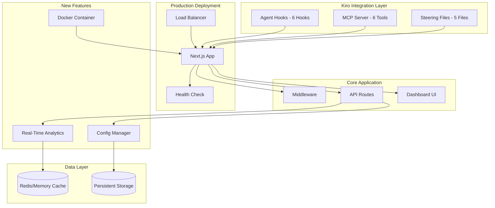
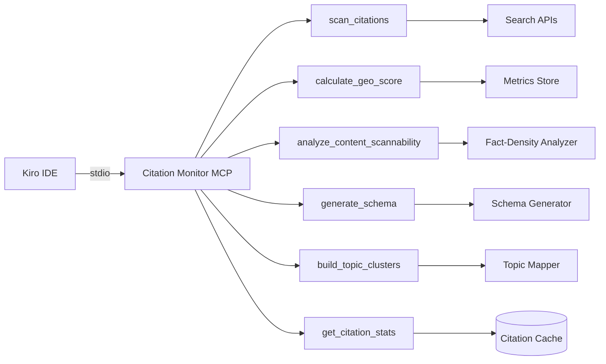

# Design Document: Chimera Hackathon Improvements

## Overview

This design transforms Chimera from a technical proof-of-concept into a production-ready SaaS product while maximizing hackathon judging scores. The improvements focus on three strategic pillars:

1. **Fix Disqualification Risks**: Working MCP server, deployment URL, demo video, KIRO_USAGE.md
2. **Maximize Kiro Implementation Score**: Enhanced hooks (6 total), advanced steering (5 files), feature-rich MCP
3. **Boost Value & Design Scores**: Polished UI, real-time analytics, enterprise features, Halloween creativity

The design prioritizes quick wins that demonstrate advanced Kiro usage while adding genuine SaaS value.

## Architecture

### Enhanced System Architecture



### MCP Server Architecture



## Components and Interfaces

### 1. MCP Server Implementation

The MCP server provides 6 tools that extend Kiro's capabilities for GEO optimization.

```typescript
/**
 * MCP Server for Citation Monitoring and GEO Optimization
 * 
 * Provides tools for:
 * - Brand mention tracking
 * - GEO score calculation
 * - Content scannability analysis
 * - Schema generation
 * - Topic clustering
 * - Citation statistics
 */
interface CitationMonitorMCP {
  // Server lifecycle
  connect(transport: StdioServerTransport): Promise<void>;
  close(): Promise<void>;
  
  // Tool handlers
  handleScanCitations(args: ScanCitationsArgs): Promise<ToolResponse>;
  handleCalculateGEOScore(args: GEOScoreArgs): Promise<ToolResponse>;
  handleAnalyzeContent(args: AnalyzeContentArgs): Promise<ToolResponse>;
  handleGenerateSchema(args: GenerateSchemaArgs): Promise<ToolResponse>;
  handleBuildTopicClusters(args: TopicClusterArgs): Promise<ToolResponse>;
  handleGetCitationStats(args: {}): Promise<ToolResponse>;
}

interface ScanCitationsArgs {
  brandTerms: string[];
  scanIntervalHours?: number;
}

interface GEOScoreArgs {
  routeHealth: number;
  contentScannability: number;
  schemaCoverage: number;
  citationAuthority: number;
}

interface AnalyzeContentArgs {
  content: string;
  url?: string;
}

interface GenerateSchemaArgs {
  content: string;
  pageUrl?: string;
}

interface TopicClusterArgs {
  pages: Array<{
    path: string;
    title: string;
    content: string;
  }>;
}

interface ToolResponse {
  content: Array<{
    type: 'text';
    text: string;
  }>;
  isError?: boolean;
}
```

### 2. Enhanced Agent Hooks

Six hooks demonstrating diverse automation workflows.

```typescript
/**
 * Hook 1: Schema Auto-Generator
 * Trigger: File Save
 * Target: src/app/**/page.tsx, src/app/**/layout.tsx, content/**\/*.md
 */
interface SchemaAutoGeneratorHook {
  trigger: 'file_save';
  filePatterns: string[];
  instructions: string;
  
  // Automatically inject JSON-LD when page components are saved
  execute(file: SavedFile): Promise<void>;
}

/**
 * Hook 2: Content Optimizer
 * Trigger: File Save
 * Target: **\/*.md, src/app/**/page.tsx
 */
interface ContentOptimizerHook {
  trigger: 'file_save';
  filePatterns: string[];
  instructions: string;
  
  // Analyze and suggest GEO improvements
  execute(file: SavedFile): Promise<void>;
}

/**
 * Hook 3: Test Scaffold Generator
 * Trigger: File Create
 * Target: src/lib/**\/*.ts, src/components/**\/*.tsx
 */
interface TestScaffoldHook {
  trigger: 'file_create';
  filePatterns: string[];
  instructions: string;
  
  // Generate property-based test templates
  execute(file: CreatedFile): Promise<void>;
}

/**
 * Hook 4: Security Scanner
 * Trigger: Manual
 */
interface SecurityScannerHook {
  trigger: 'manual';
  instructions: string;
  
  // Scan for hardcoded secrets and API keys
  execute(): Promise<SecurityReport>;
}

/**
 * Hook 5: Sitemap Updater
 * Trigger: File Delete
 * Target: src/app/**\/page.tsx
 */
interface SitemapUpdaterHook {
  trigger: 'file_delete';
  filePatterns: string[];
  instructions: string;
  
  // Regenerate sitemap when routes are deleted
  execute(file: DeletedFile): Promise<void>;
}

/**
 * Hook 6: Fact-Density Analyzer (existing, enhanced)
 * Trigger: File Save
 * Target: **\/*.md, **\/*.tsx
 */
interface FactDensityAnalyzerHook {
  trigger: 'file_save';
  filePatterns: string[];
  instructions: string;
  
  // Enhanced with more detailed suggestions
  execute(file: SavedFile): Promise<void>;
}
```

### 3. Advanced Steering Files

Five steering files with different inclusion modes.

```typescript
/**
 * Steering File 1: AI Optimization Patterns (Always Included)
 * 
 * Guides all code generation to follow GEO-first principles
 */
interface AIOptimizationPatternsSteering {
  inclusion: 'always';
  content: string;
  
  // Enforces:
  // - JSON-LD schema inclusion
  // - Semantic HTML structure
  // - Machine-readable content patterns
  // - Fuzzy routing considerations
}

/**
 * Steering File 2: Property Testing Patterns (Always Included)
 * 
 * Guides property-based test creation
 */
interface PropertyTestingPatternsSteering {
  inclusion: 'always';
  content: string;
  
  // Enforces:
  // - fast-check usage
  // - Smart generator creation
  // - Property annotation format
  // - 100+ iteration minimum
}

/**
 * Steering File 3: Component Patterns (Conditional - *.tsx)
 * 
 * Guides React component creation for AI scannability
 */
interface ComponentPatternsSteering {
  inclusion: 'fileMatch';
  fileMatchPattern: '**/*.tsx';
  content: string;
  
  // Enforces:
  // - Semantic JSX structure
  // - Schema injection patterns
  // - Accessibility compliance
  // - Performance optimization
}

/**
 * Steering File 4: API Standards (Conditional - app/api/**)
 * 
 * Guides API route creation
 */
interface APIStandardsSteering {
  inclusion: 'fileMatch';
  fileMatchPattern: 'app/api/**/*';
  content: string;
  
  // Enforces:
  // - RESTful conventions
  // - Error response formats
  // - Machine-readable payloads
  // - Performance requirements
}

/**
 * Steering File 5: Troubleshooting Guide (Manual)
 * 
 * On-demand guidance for debugging
 */
interface TroubleshootingGuideSteering {
  inclusion: 'manual';
  content: string;
  
  // Provides:
  // - Common error solutions
  // - Debugging strategies
  // - Performance optimization tips
  // - MCP troubleshooting
}
```

### 4. Real-Time Analytics API

Enhanced analytics with time-range filtering and live updates.

```typescript
interface AnalyticsAPI {
  // GET /api/analytics?range=24h&metric=all
  getAnalytics(params: AnalyticsParams): Promise<AnalyticsResponse>;
}

interface AnalyticsParams {
  range: '1h' | '24h' | '7d' | '30d';
  metric: 'all' | 'traffic' | 'routing' | 'learning' | 'citations';
}

interface AnalyticsResponse {
  traffic: {
    totalRequests: number;
    aiAgentRequests: number;
    humanRequests: number;
    byAgentType: Record<string, number>;
    hourlyBreakdown: Array<{ hour: string; count: number }>;
  };
  
  routing: {
    total404s: number;
    successfulRedirects: number;
    failed404s: number;
    averageConfidence: number;
    topHallucinations: Array<{ path: string; count: number }>;
    performanceMetrics: {
      averageLatency: number;
      p95Latency: number;
      successRate: number;
    };
  };
  
  learning: {
    totalAliases: number;
    autoGeneratedAliases: number;
    manualAliases: number;
    recentAliases: number;
    aliasUsage: Array<{
      alias: string;
      targetPath: string;
      usage: number;
      autoGenerated: boolean;
    }>;
  };
  
  citations: {
    totalCitations: number;
    earnedMedia: number;
    ownedMedia: number;
    averageAuthority: number;
    sentimentBreakdown: Record<string, number>;
    topDomains: Array<{ domain: string; count: number }>;
  };
  
  status: {
    timestamp: string;
    timeRange: string;
    systemHealth: 'healthy' | 'degraded' | 'unhealthy';
    lastUpdate: string;
  };
}
```

### 5. Enterprise Configuration System

Tier-based configuration with feature flags.

```typescript
interface ConfigManager {
  // Configuration management
  getConfig(): ChimeraConfig;
  updateConfig(updates: Partial<ChimeraConfig>): void;
  applyTier(tier: 'free' | 'pro' | 'enterprise'): void;
  
  // Validation
  validateConfig(): ValidationResult;
  
  // Feature flags
  isFeatureEnabled(feature: string): boolean;
  
  // Import/Export
  exportConfig(): string;
  importConfig(configJson: string): void;
}

interface ChimeraConfig {
  fuzzyRouting: {
    enabled: boolean;
    confidenceThreshold: number;
    maxLatencyMs: number;
    enableLearning: boolean;
    aliasThreshold: number;
    cacheSize: number;
  };
  
  contentAnalysis: {
    enabled: boolean;
    autoAnalyze: boolean;
    scannabilityThreshold: number;
    enableSuggestions: boolean;
    batchSize: number;
  };
  
  schemaGeneration: {
    enabled: boolean;
    autoGenerate: boolean;
    entityTypes: string[];
    validationLevel: 'strict' | 'moderate' | 'lenient';
  };
  
  citationMonitoring: {
    enabled: boolean;
    scanIntervalHours: number;
    brandTerms: string[];
    domainWhitelist: string[];
    sentimentAnalysis: boolean;
  };
  
  analytics: {
    enabled: boolean;
    retentionDays: number;
    realTimeUpdates: boolean;
    exportEnabled: boolean;
    webhooks: string[];
  };
  
  performance: {
    cacheEnabled: boolean;
    cacheTTL: number;
    rateLimiting: {
      enabled: boolean;
      requestsPerMinute: number;
      burstLimit: number;
    };
    edgeDeployment: boolean;
  };
  
  security: {
    apiKeyRequired: boolean;
    allowedOrigins: string[];
    encryptionEnabled: boolean;
    auditLogging: boolean;
  };
  
  integrations: {
    webhook: {
      enabled: boolean;
      endpoints: string[];
      events: string[];
    };
    analytics: {
      googleAnalytics?: string;
      mixpanel?: string;
      segment?: string;
    };
    notifications: {
      slack?: string;
      discord?: string;
      email?: string[];
    };
  };
}

interface ValidationResult {
  valid: boolean;
  errors: string[];
}
```

### 6. Health Check System

Comprehensive health monitoring for production deployment.

```typescript
interface HealthCheckAPI {
  // GET /api/health
  checkHealth(): Promise<HealthResponse>;
}

interface HealthResponse {
  status: 'healthy' | 'degraded' | 'unhealthy';
  timestamp: string;
  version: string;
  environment: string;
  uptime: number;
  responseTime: number;
  
  checks: {
    database: HealthCheck;
    cache: HealthCheck;
    fuzzyRouting: HealthCheck;
    mcp: HealthCheck;
    storage: HealthCheck;
  };
  
  config: {
    fuzzyRoutingEnabled: boolean;
    contentAnalysisEnabled: boolean;
    citationMonitoringEnabled: boolean;
    analyticsEnabled: boolean;
  };
  
  metrics: {
    memoryUsage: NodeJS.MemoryUsage;
    cpuUsage: NodeJS.CpuUsage;
  };
}

interface HealthCheck {
  status: 'healthy' | 'degraded' | 'unhealthy';
  message?: string;
}
```

### 7. Dashboard UI Components

Polished, interactive dashboard with real-time updates.

```typescript
/**
 * Main Dashboard Component
 * 
 * Features:
 * - Animated GEO Health Score gauge
 * - Color-coded metric cards
 * - Real-time updates via polling
 * - Interactive charts and graphs
 * - Sortable/filterable data tables
 * - Tooltips with detailed explanations
 * - Halloween-themed design elements
 */
interface DashboardUI {
  // Main components
  GEOHealthGauge: React.FC<{ score: number }>;
  MetricCard: React.FC<MetricCardProps>;
  TrafficChart: React.FC<{ data: TrafficData }>;
  HallucinationTable: React.FC<{ entries: HallucinationEntry[] }>;
  AgentBreakdown: React.FC<{ agents: Record<string, number> }>;
  CitationList: React.FC<{ citations: Citation[] }>;
  TopicClusterGraph: React.FC<{ clusters: TopicCluster[] }>;
  
  // Real-time updates
  useRealTimeAnalytics(refreshInterval: number): AnalyticsResponse;
  
  // Interactions
  handleMetricClick(metric: string): void;
  handleAliasDelete(aliasId: string): Promise<void>;
  handleExportData(format: 'json' | 'csv'): void;
}

interface MetricCardProps {
  title: string;
  value: number | string;
  trend?: 'up' | 'down' | 'stable';
  status: 'good' | 'warning' | 'critical';
  tooltip: string;
  icon?: React.ReactNode;
}
```

## Data Models

### MCP Tool Response

```typescript
interface MCPToolResponse {
  success: boolean;
  data?: unknown;
  error?: string;
  tool: string;
  timestamp: string;
}
```

### Hook Execution Log

```typescript
interface HookExecutionLog {
  id: string;
  hookName: string;
  trigger: 'file_save' | 'file_create' | 'file_delete' | 'manual';
  filePath?: string;
  executedAt: Date;
  duration: number;
  success: boolean;
  error?: string;
  changes: string[];
}
```

### Configuration Tier

```typescript
interface ConfigTier {
  name: 'free' | 'pro' | 'enterprise';
  limits: {
    maxRoutes: number;
    maxAliases: number;
    analyticsRetentionDays: number;
    rateLimitRPM: number;
  };
  features: {
    fuzzyRouting: boolean;
    contentAnalysis: boolean;
    schemaGeneration: boolean;
    citationMonitoring: boolean;
    realTimeAnalytics: boolean;
    apiAccess: boolean;
    webhooks: boolean;
    whiteLabel: boolean;
  };
}
```

## Correctness Properties

*A property is a characteristic or behavior that should hold true across all valid executions of a system-essentially, a formal statement about what the system should do. Properties serve as the bridge between human-readable specifications and machine-verifiable correctness guarantees.*

### Property 1: MCP Server Tool Registration
*For any* MCP server startup, all 6 tools (scan_citations, calculate_geo_score, analyze_content_scannability, generate_schema, build_topic_clusters, get_citation_stats) SHALL be registered and available in Kiro's MCP panel.
**Validates: Requirements 1.1, 1.7**

### Property 2: MCP Tool Response Format
*For any* MCP tool invocation, the response SHALL contain a `content` array with at least one text element, and if an error occurs, `isError` SHALL be true.
**Validates: Requirements 1.2-1.6**

### Property 3: Hook File Pattern Matching
*For any* file save/create/delete event, if the file path matches a hook's pattern, the hook SHALL execute; if no pattern matches, no hook SHALL execute.
**Validates: Requirements 2.1-2.5**

### Property 4: Steering File Inclusion Logic
*For any* Kiro interaction, always-included steering files SHALL be loaded, conditional steering SHALL be loaded only when file patterns match, and manual steering SHALL be loaded only when explicitly referenced.
**Validates: Requirements 3.1-3.5**

### Property 5: Health Check Status Determination
*For any* health check, if all component checks return 'healthy', overall status SHALL be 'healthy'; if any check returns 'unhealthy', overall status SHALL be 'unhealthy'; otherwise status SHALL be 'degraded'.
**Validates: Requirements 10.3, 10.4**

### Property 6: Analytics Time Range Filtering
*For any* analytics request with time range T, all returned data points SHALL have timestamps within the range [now - T, now].
**Validates: Requirements 8.1**

### Property 7: Configuration Tier Enforcement
*For any* configuration tier, when a feature is disabled in that tier, attempts to use the feature SHALL be gracefully blocked without errors.
**Validates: Requirements 9.2**

### Property 8: Configuration Validation Completeness
*For any* invalid configuration (e.g., confidence threshold > 1, negative latency), validation SHALL return `valid: false` with specific error messages.
**Validates: Requirements 9.4**

### Property 9: Real-Time Analytics Consistency
*For any* two consecutive analytics API calls within 1 second, the traffic counts SHALL be monotonically increasing (never decreasing).
**Validates: Requirements 8.1**

### Property 10: Docker Container Health
*For any* Docker container start, the health check SHALL pass within 30 seconds, indicating the application is ready to serve requests.
**Validates: Requirements 11.3**

## Error Handling

### MCP Server Errors

| Error Scenario | Handling Strategy | User Impact |
|---------------|-------------------|-------------|
| Tool execution timeout | Return error response with timeout message | Kiro shows error, suggests retry |
| Invalid tool arguments | Validate and return specific error | Kiro shows validation errors |
| MCP server crash | Auto-restart with exponential backoff | Temporary unavailability |
| stdio communication failure | Log error, attempt reconnection | MCP tools unavailable |

### Hook Execution Errors

| Error Scenario | Handling Strategy | User Impact |
|---------------|-------------------|-------------|
| Hook script failure | Log error, continue execution | User notified of failure |
| File access denied | Skip hook, log warning | Hook silently skipped |
| Infinite loop detection | Timeout after 30s, kill process | Hook marked as failed |
| Multiple hooks conflict | Execute sequentially, not parallel | Slower but safer |

### Deployment Errors

| Error Scenario | Handling Strategy | User Impact |
|---------------|-------------------|-------------|
| Environment variable missing | Use defaults, log warning | Degraded functionality |
| Port already in use | Try alternative ports | Application starts on different port |
| Database connection failure | Use in-memory fallback | No persistence |
| Health check failure | Return 503, log details | Load balancer removes instance |

## Testing Strategy

### Dual Testing Approach

**Unit Tests** verify specific scenarios:
- MCP tool responses for known inputs
- Hook execution for specific file patterns
- Configuration validation for edge cases
- Health check component verification

**Property-Based Tests** verify universal properties:
- Any valid MCP tool call returns proper response format
- Any file event triggers correct hooks
- Any configuration tier enforces feature limits
- Any analytics time range filters correctly

### Testing Framework

- **Unit Testing**: Vitest
- **Property-Based Testing**: fast-check
- **Integration Testing**: Playwright (for dashboard UI)
- **Minimum Iterations**: 100 per property test

### Test Organization

```
tests/
├── unit/
│   ├── mcp-server.test.ts
│   ├── hooks.test.ts
│   ├── config-manager.test.ts
│   ├── analytics-api.test.ts
│   └── health-check.test.ts
├── property/
│   ├── mcp.property.test.ts          # Properties 1-2
│   ├── hooks.property.test.ts        # Property 3
│   ├── steering.property.test.ts     # Property 4
│   ├── health.property.test.ts       # Property 5
│   ├── analytics.property.test.ts    # Properties 6, 9
│   ├── config.property.test.ts       # Properties 7-8
│   └── docker.property.test.ts       # Property 10
├── integration/
│   ├── mcp-kiro.integration.test.ts
│   ├── hooks-kiro.integration.test.ts
│   └── dashboard-ui.integration.test.ts
└── e2e/
    └── full-workflow.e2e.test.ts
```

## Deployment Architecture

### Vercel Deployment (Recommended)

```yaml
# vercel.json
{
  "buildCommand": "npm run build",
  "devCommand": "npm run dev",
  "installCommand": "npm install",
  "framework": "nextjs",
  "regions": ["iad1"],
  "env": {
    "NODE_ENV": "production",
    "NEXT_PUBLIC_API_URL": "@api_url"
  },
  "headers": [
    {
      "source": "/api/(.*)",
      "headers": [
        {
          "key": "Cache-Control",
          "value": "s-maxage=60, stale-while-revalidate"
        }
      ]
    }
  ]
}
```

### Docker Deployment (Alternative)

```dockerfile
# Multi-stage build for optimized image size
FROM node:18-alpine AS base
FROM base AS deps
FROM base AS builder
FROM base AS runner

# Health check configuration
HEALTHCHECK --interval=30s --timeout=3s --start-period=5s --retries=3 \
  CMD curl -f http://localhost:3000/api/health || exit 1
```

### Environment Variables

```bash
# Required
NODE_ENV=production
NEXT_PUBLIC_API_URL=https://chimera-ai-edge.vercel.app

# Optional (for enhanced features)
BRAND_TERMS=Chimera,AI-First Edge,GEO Health
SEARCH_API_KEY=your_search_api_key
ANALYTICS_WEBHOOK=https://your-webhook.com/analytics

# MCP Configuration
MCP_AUTO_APPROVE=analyze_content_scannability,generate_schema,get_citation_stats
```

## Demo Video Script

### Structure (Under 3 minutes)

**0:00-0:15 - Hook (15 seconds)**
- Show AI agent hitting 404 on hallucinated URL
- Dramatic "AI Bounce" - agent leaves immediately
- Text: "AI agents have zero tolerance for errors"

**0:15-0:45 - Problem & Solution (30 seconds)**
- Explain AI Bounce problem with statistics
- Introduce Chimera: "Semantic fuzzy routing for the Agent Economy"
- Show architecture diagram

**0:45-1:30 - Live Demo (45 seconds)**
- Demonstrate fuzzy routing: hallucinated URL → semantic match → redirect
- Show dashboard: GEO Health Score, real-time analytics
- Highlight alias learning: repeated hallucinations → permanent alias

**1:30-2:15 - Kiro Integration (45 seconds)**
- Show spec-driven development workflow
- Demonstrate agent hook execution (schema auto-generation)
- Show MCP tools in action (content analysis)
- Highlight property-based testing (175 tests)

**2:15-2:45 - SaaS Features (30 seconds)**
- Show enterprise configuration system
- Demonstrate real-time analytics API
- Highlight deployment options (Vercel, Docker)

**2:45-3:00 - Call to Action (15 seconds)**
- "Don't let AI agents 404 on your brand"
- Show GitHub repo and deployment URL
- Halloween-themed closing

## KIRO_USAGE.md Structure

### Required Sections

1. **Spec-Driven Development**
   - How requirements → design → tasks workflow was used
   - Benefits over pure vibe coding
   - Property-based testing integration

2. **Vibe Coding Examples**
   - Most impressive code generation moments
   - How conversation structure led to better results
   - Iterative refinement examples

3. **Agent Hooks (6 hooks)**
   - Schema Auto-Generator: Automated JSON-LD injection
   - Content Optimizer: GEO improvement suggestions
   - Test Scaffold: Property test template generation
   - Security Scanner: Secret detection
   - Sitemap Updater: Automatic sitemap regeneration
   - Fact-Density Analyzer: Content scannability analysis
   - Before/after comparisons showing time saved

4. **Steering Docs (5 files)**
   - AI Optimization Patterns: GEO-first code generation
   - Property Testing Patterns: Test quality improvement
   - Component Patterns: Conditional inclusion for React files
   - API Standards: Conditional inclusion for API routes
   - Troubleshooting Guide: Manual inclusion for debugging
   - Strategic decisions and experimentation

5. **MCP Server (6 tools)**
   - Citation monitoring capabilities
   - How MCP extended Kiro beyond built-in features
   - Workflow improvements enabled
   - Integration with existing codebase

6. **Results & Metrics**
   - 175+ property-based tests generated
   - 24 correctness properties validated
   - Development time saved
   - Code quality improvements

